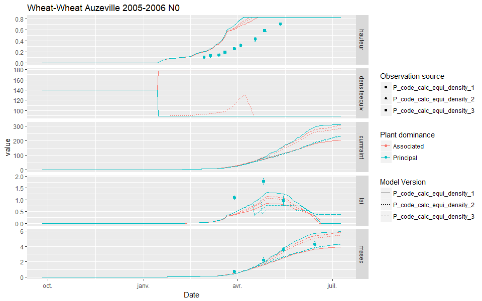

# Plant density and equivalent plant density {#plantdensity}

```{r, include=FALSE}
if(knitr:::pandoc_to() == "html") {
  knitr::opts_chunk$set(echo = TRUE)
}else{
  knitr::opts_chunk$set(echo = FALSE)
}
```

## Introduction

The plant density, which is related to the interrow distance, seems to be an important formalism to describe the crop, and particularly for mixed crops. Several computations are made to represent plant competition in the STICS model, making the density effect a complex process. Lets describe each step of the process to have a clearer representation in mind.

## The density effect on LAI

In the model, the plant density is taken as a negative effect upon the `LAI` growth as soon as a threshold of `LAI` is reached. This threshold (`P_laicomp`) represents the moment when the leaf surface of a plant start becoming competitive for light against another plant (from the same species or not). So whenever the `LAI` is higher than `P_laicomp`, the effect of the density (`efdensite`) become closer to 0 (the effect is null when equal to 1, and maximum at 0).
This effect is computed as:
$ef_{densite}=\min\left\{1.0\ ;\ e^{P_{adens}\cdot\frac{log(densiteequiv)}{P_{bdens}}}\right\}$
or more simply:
$ef_{densite}=\min\left\{1.0\ ;\ (\frac{densiteequiv}{P_{bdens}})^{P_{adens}}\right\}$

> Replace the equation in the model to simplify too ? 

Here is a plot representing the density effect along the equivalent density:

```{r message=FALSE, warning=FALSE}
library(tidyverse)
expand.grid(densiteequiv= 140:280, P_adens=c(-0.54,-0.7),P_bdens=c(7,10))%>%
  transmute(Parameters= paste("P_adens=",P_adens,"P_bdens=",P_bdens, sep=", "),
            densiteequiv,
            efdensite= pmin(1.0,(exp(P_adens * (log(densiteequiv/P_bdens))))))%>%
  arrange(Parameters)%>%
  ggplot(aes(x=densiteequiv))+
  geom_point(aes(y=efdensite,colour= Parameters))+
  labs(x= "Equivalent density", y= "Density effect (0-1)", colour= "a and b parameters values",
       title="Equivalent density / density effect")
```


So the higher the density, the higher the negative effect on `LAI`.

## The equivalent density 

In sole crops, the density effect is straightforward. However, under the case of mixed crops, the density effect can be higher for the dominated plant compared to its equivalent in sole crops. Indeed, a pea in sole crop would have a given competition with other close plants, but a different one when mixed with wheat, where the same density of wheat can give higher competition effect for light because it is taller.

Then the density effect is computed as an equivalent density instead (`densiteequiv`), that can differ from the sowing density for the dominated crop to increase the negative effect of `efdensite` compared to a sole crop.

The previous implementation in STICS was simple. As soon as a plant become dominated, it had an increased equivalent density compared to its actual density (*e.g.* doubled). After some discussion with the STICS intercrop team, this formalism was considered not suitable for two reasons: 

* Whenever a plant become shorter its density drastically increases regardless of the height difference. We propose to modify the formalism to consider the height difference explicitly while computing the equivalent density.

* For the moment, the competition induced by the density of the other species (*i.e.* interspecies competition) was re-included in the equivalent density computation using the `P_bdensp1` and `P_bdensp2` parameters, which come from the sole crop formalism, where it is used to consider intra-species competition effect. The equivalent density was originally set up to consider the decrease in light quality when a plant has another plant above it. Adding another computation of competition based on the density of the other plant could be redundant, because it is already considered during the light interception (see Chapter \@ref(Interrow) and \@ref(Light)). Consequently, we propose to remove this computation from the equivalent density formalism, and to let the `P_bdensp1` and `P_bdensp2` parameters being used to compute the `efdensite` variable only.
 
## Proposition for new equivalent density formalism

### Definition of the different propositions 

The user will now have four options to compute the equivalent density, depending on the value of the `P_code_calc_equi_density` parameter: 

* (1): Previous computation : $density_{Equivalent}= density_{p2} + \frac{density_{p1}}{P_{bdensp1}}\cdot P_{bdensp2}$

* (2): Improved computation to define the equivalent density as a function of the height difference between the plants as follow: 
$density_{Equivalent} =\begin{cases}\Delta_{height} > hauteur_{threshold} & density_{p2} + \frac{density_{p1}}{P_{bdensp1}}\cdot P_{bdensp2}  \\ \Delta_{height} < hauteur_{threshold} & density_{p2}+slope\cdot abs\left|\Delta_{height}\right| \end{cases}$  
with $diffx= \frac{density_{p1}}{P_{bdensp1}}\cdot P_{bdensp2}$ and $slope= \frac{diffx}{hauteur_{threshold}}$

* (3): Improved computation to define the equivalent density as a function of the height difference between the plants, and using different parameters for intraspecific and interspecific competition, with simpler meanings. This formalism would give no increase in equivalent density until a given threshold (`hauteur_threshold`), after which a progressive increase in the equivalent density would happen until the maximum allowed. In this computation, the slope would be computed by the model, and the equivalent density would be computed as follows:  $density_{Equivalent} =\begin{cases}\Delta_{height} < hauteur_{threshold} & density_{p2} \\ \Delta_{height} > hauteur_{threshold} & b + \Delta_{height}\cdot slope \\ \Delta_{height} > hauteur_{threshold_2} & Max_{equDens} \end{cases}$  
with $slope= \frac{Max_{equDens}}{hauteur_{threshold_2}-hauteur_{threshold}}$.
This formalism would include three parameters:
    * `hauteur_threshold`: the difference in height below which no competition is occuring

    * `hauteur_threshold_2`: the difference in height below which a progressive competition is occuring

    * `Max_equDens`: the maximum equivalent density allowed (generally the sole crop density).

* Any other value: the equivalent density is equal to the true plant density 

### Visual representation of the options 

The two new formalisms are both linking the equivalent density to the difference of height between the two plants, but using different parameters and outputs.
```{r}
df_DE= data.frame(Delta_height= seq(from= 0.01, to= 1, by= 0.01))
density_p1= 140
density_p2= 30
P_bdensp1= 7 ; P_bdensp2= 1.5
hauteur_threshold= 0.2
diffx = density_p1 / P_bdensp1 * P_bdensp2
slope= diffx/hauteur_threshold
```

Here is a visual representation of the equivalent density when `P_code_calc_equi_density= 2` for a wheat-pea intercrop with a plant density of `r density_p1` for the wheat as the principal species and `r density_p2` for the pea as the associated species:

```{r P_code_calc_equi_density_2}
df_DE%>%
  mutate(Equ_density= 
           ifelse(Delta_height>hauteur_threshold,
                  density_p2 + density_p1/P_bdensp1 *P_bdensp2,
                  density_p2+slope*abs(Delta_height))
  )%>%
  ggplot(aes(y= Equ_density, x= Delta_height, colour=Equ_density))+
  geom_point()+
  labs(colour = "Equivalent density",
       x = "Delta height (Dominant Plant Height-Dominated Plant Height)",
       y= "Dominated plant equivalent density",
       title= "New formalism for equivalent plant density")
```

This option has several implications in the model, notably that the dominated plant is less impacted by the competition with the dominant plant when both have approximately the same height.


Here is a visual representation of the same output when `P_code_calc_equi_density= 3`:

```{r P_code_calc_equi_density_3}
df_DE= data.frame(Delta_height= seq(from= 0.01, to= 1, by= 0.01))
hauteur_threshold_2= 0.8
Max_equDens= 60
slope= (Max_equDens)/(hauteur_threshold_2-hauteur_threshold)
b= density_p2-slope*hauteur_threshold
  
df_DE%>%
  mutate(slope= (Max_equDens)/(hauteur_threshold_2-hauteur_threshold),
         Equ_density= 
           ifelse(Delta_height>hauteur_threshold,
                  slope*abs(Delta_height)+b,density_p2))%>%
  mutate(Equ_density= ifelse(Equ_density>Max_equDens,
                             Max_equDens,Equ_density))%>%
  ggplot(aes(y= Equ_density, x= Delta_height, colour=Equ_density))+
  geom_point()+
  labs(colour = "Equivalent density",
       x = "Delta height (Dominant Plant Height-Dominated Plant Height)",
       y= "Dominated plant equivalent density",
       title= "New (third) formalism for equivalent plant density")
```

This formalism considers no interspecific competition for the quality of light while the difference in height is low, and then an increased competition until a maximum is reached.  

### Comparison between options

A comparison of the different formalisms was made using the [sticRs](https://github.com/VEZY/sticRs) package, from which a summary plot was extracted, and the results are shown in Figure \@ref(fig:trgcomparison2).



It is not very clear from the figure, but the second and third options (*i.e.* `P_code_calc_equi_density= 2` and `P_code_calc_equi_density= 3`) for the equivalent density computation are both less severe than the previous one (`P_code_calc_equi_density= 1`) for the dominated plant. The second one has effect on the equivalent effect for limited time only (dashed red curve), while the third one show no increase in equivalent density all along the crop life because the height difference remains below the first threshold. Consequently, the dominated plant intercepts more light (see `cumraint` and `fapar`) and has a higher `LAI` using the third option.
