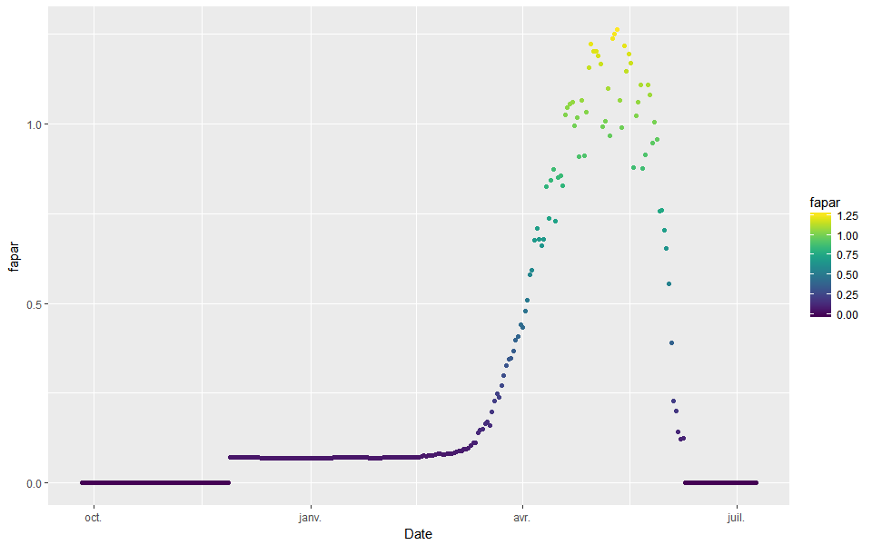
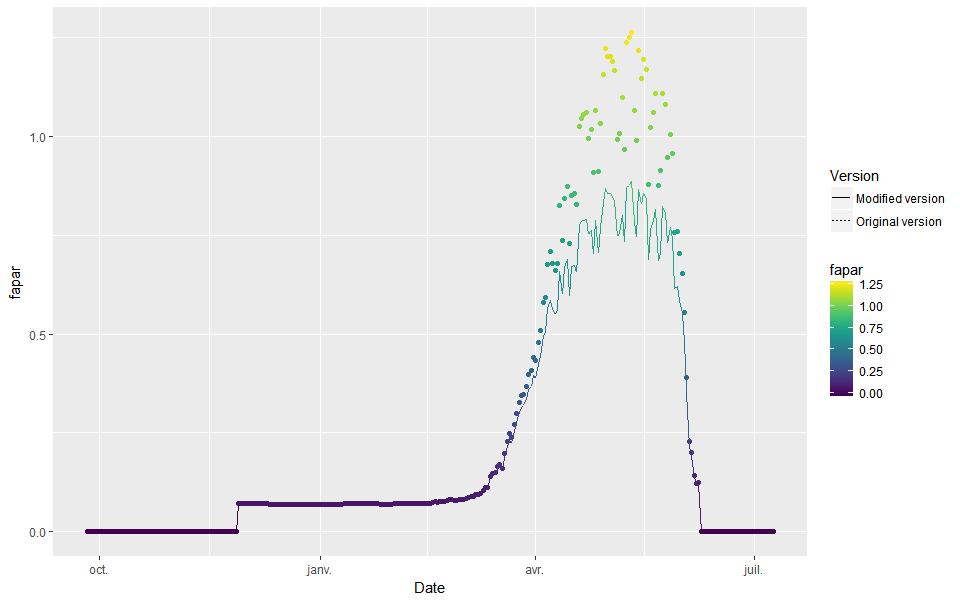

# Issue on FaPAR greater than one {#FAPARissue}

## Introduction

The fraction of absorbed `PAR` (`fapar`) should have values between 0 (no absorption) and 1 (full absorption). The STICS model computed values greater than 1 sometimes (Figure \@ref(fig:FAPARhigh)), which is problematic.

## The solution to the problem

The `fapar` is computed in the `raytrans` subroutine, which only uses the `PAR` transmitted by the dominant plant to a plane above the dominated plant components. This `PAR` has lower values compared to the atmospheric `PAR` (*i.e.* from the sky), leading to greater `fapar`. 
We propose to recompute the `fapar` after the `biomaer` subroutine to use the atmospheric `PAR` instead, which is what the user would expect.

The new fapar is now computed as `p(i)%fapar(ens)= p(i)%raint(ens) / (trg_bak * pg%P_parsurrg)`, and gives better results (Figure \@ref(fig:FAPARcorrected)).

