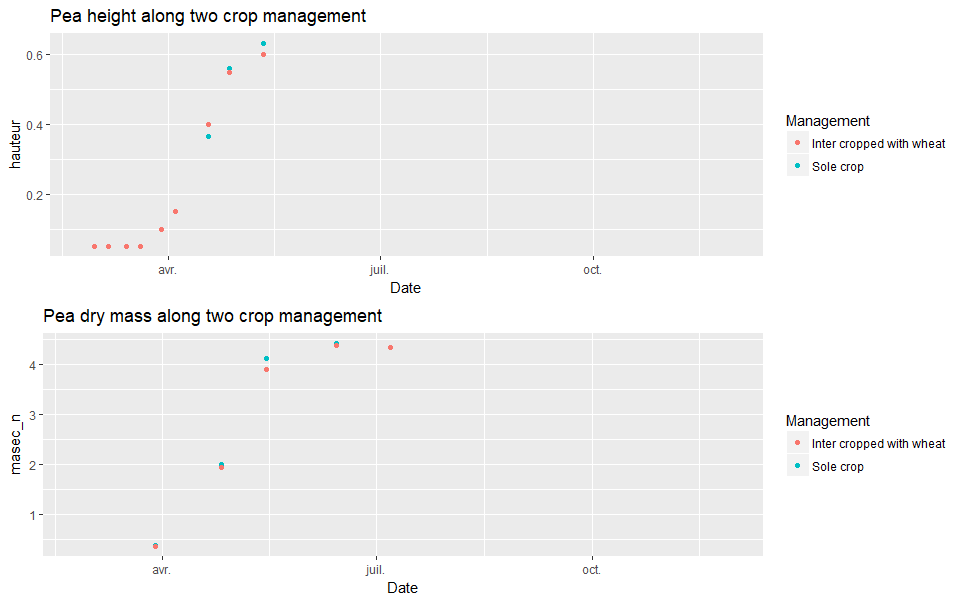
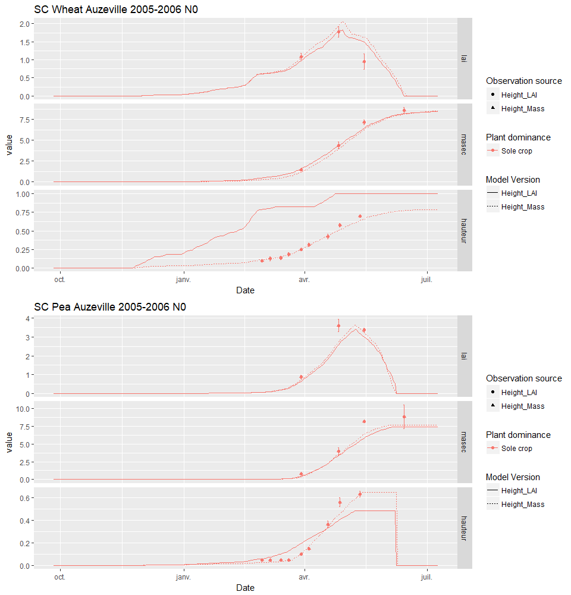
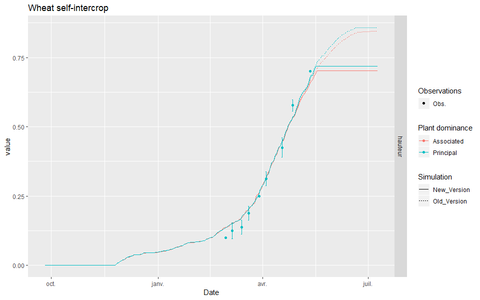

# Computing plant height {#height}


## Introduction

Plant `height` is not very well simulated for the moment. It is computated using the plant width, which depends itself on the plant `lai` (`lai`+`eai`+`laisen`). Please see Chapter \@ref(Light) for more details. Figure \@ref(fig:height1) shows the simulated `height` of wheat in Auzeville, and the variables from which it is computed.


The plant `height` is important in the case of intercrops because it has high impact on the light interception of both species. 
Indeed, a sensitivity analysis was performed  using the [sticRs](https://github.com/VEZY/sticRs) package on the parameter that links the `lai` to the `height`: `P_rapforme`. The results are shown below (see `html` version of this book for interactivity):

```{r fig.height=11.69, fig.width=8.27, message=FALSE, warning=FALSE}
height_sensi= sticRs::load_sensi(dirpath = "data/rapforme_sensitivity")
if(knitr:::pandoc_to() == "html") {
  gg_objects= 
    lapply(height_sensi$gg_objects, 
           function(x){
             plotly::ggplotly(x, tooltip= "group")
           })
  htmltools::tagList(gg_objects)
}else{
  multiplot(plotlist = height_sensi$gg_objects)
}
```


As we can see on the above plots, as the plant `height` is affected, its `lai` is also impacted afterwards.
We can also see that no values of `P_rapforme` gave satisfactory plant `height`, so maybe the link between the plant `lai` and the plant `height` is not as straightforward as previously thought, and maybe there is another variable that could be better correlated to it.


## Link between height and lai and dry mass

Using the observations from Auzeville, we plotted the evolution of the plant `height` through time along the `lai` and the `masec` (*i.e.* dry mass) to see if and how they are correlated. The Figure \@ref(fig:height2) shows this evolution with standardized and linearly interpolated observed values for all variables to make it easier to compare.


The Figure \@ref(fig:height2) shows that the plant `height` is better correlated to the `masec` than to the `lai`. We propose to either use the `masec` or `somcour` to compute it rather than the `lai`.

## Computing plant height

### Observations

The plant `height` could be computed by either using the plant dry mass (`masec`) or more simply the development stage, derived from cumulated degree days (`somcour`).
The second method could be much simpler to parameterize from field, however, both plants experience the same microclimate in STICS for intercrops, so a plant growing dominated by an another plant could have the same cumulative temperature than a plant in sunlit conditions. Hence, this method would not consider the competition effect in interspecies for `height`, so it cannot be implemented as long as both plants have the same `somcour`.

To document further this phenomenon, Figure \@ref(fig:Peaheight) shows that a Pea grown in intercrop with a wheat has a lower `height` than a Pea grown in solecrop, and that the dry mass is a good proxy to predict this behaviour.



Hence, we will implement a computation of the plant `height` using the plant dry mass (`masec`).

### Stresses

Water and nitrogen stresses can both influence the `height` of a plant. Figure \@ref(fig:wheatheightN) shows that the maximum `height` is reduced for the wheat grown under nitrogen stress (*i.e.* no nitrogen feritilization). However, the `height` and massec relationship are very close for both management, only the dry mass is higher for fertilized wheat, which gives a higher `height` in the end.


Consequently, height is indeed influenced by nitrogen stress, but it appears from our data that it is only through the `height~masen_n` relationship. Conequently, the `height` computation shouldn't be corrected by any nitrogen indices, because this stress is already accounted for in the dry mass computation.


### Computation

The new computation is implemented in STICS as a new subroutine (`formplante_mas`) that is called instead of `formplante` if the newly defined `P_code_shape` parameter is equal to `2`. This subroutine is largely based on the previous one, conserving all side effects of `P_hautmax`, `P_hautmaxtec`, `P_largtec` and `originehaut` but add a computation of the plant height using an allometric relationship with the dry mass as follow :  
$hauteur= P_{hautbase} + P_{hautK} \cdot masec^{P_{hautA}}$

The `P_hautbase` parameter is a parameter from `formplante`, and is used as the intercept of the relationship, *i.e* the base height when the dry mass is equal to 0. `P_hautK` is a new parameter that defines the constant of proportionality that reflects the importance of the relationship, and `P_hautA` the scaling exponent, or the allometric coefficient. Allometric relationships are simple yet powerfull laws used to describe diverse relationships for wide range of situations. Further documentation can be found on the [wikipedia webpage](https://en.wikipedia.org/wiki/Allometry).


### Results

Two simulations of a wheat in sole crop and a pea in sole crop were run using STICS to asses the potential of the new computation for height modelling, and the outputs are displayed in Figure \@ref(fig:heightWheatSC).  




The results show that using `masec` instead of the `lai` to model plant height gives better results. The model will now be used with this formalism.

### Stop height~masec link at stage X

The height~masec link can stop existing as soon as a plant reach a certain development stage. For example, wheat stops growing in height from the moment it is flowering. 

Hence, a new parameter (`P_stage_const_height`) was added to have the choice to break this link at any developing stage from this list : "lax", "sen", "flo", "mat" or "rec".

Figure \@ref(fig:constheight) shows the new results, with `P_stage_const_height= flo` for both plants.  


