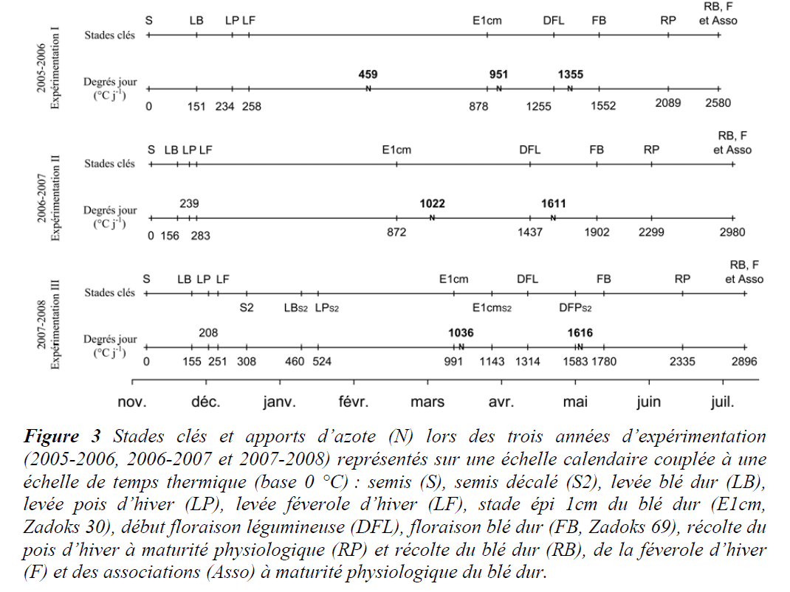
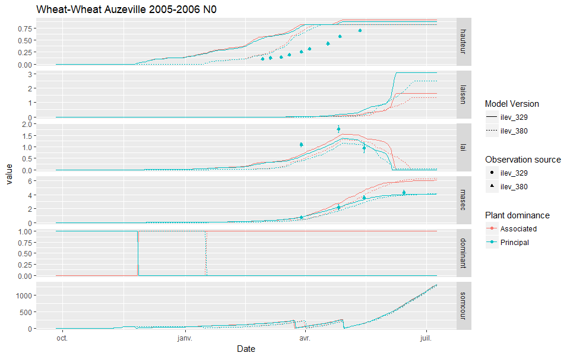
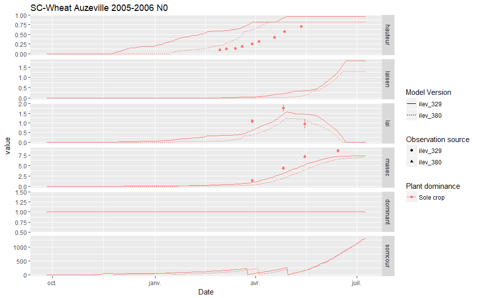
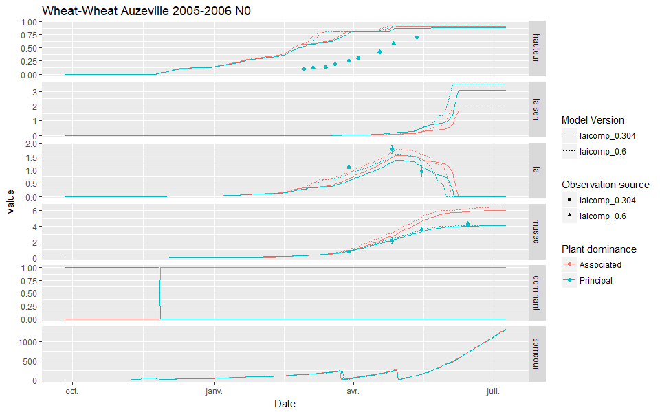
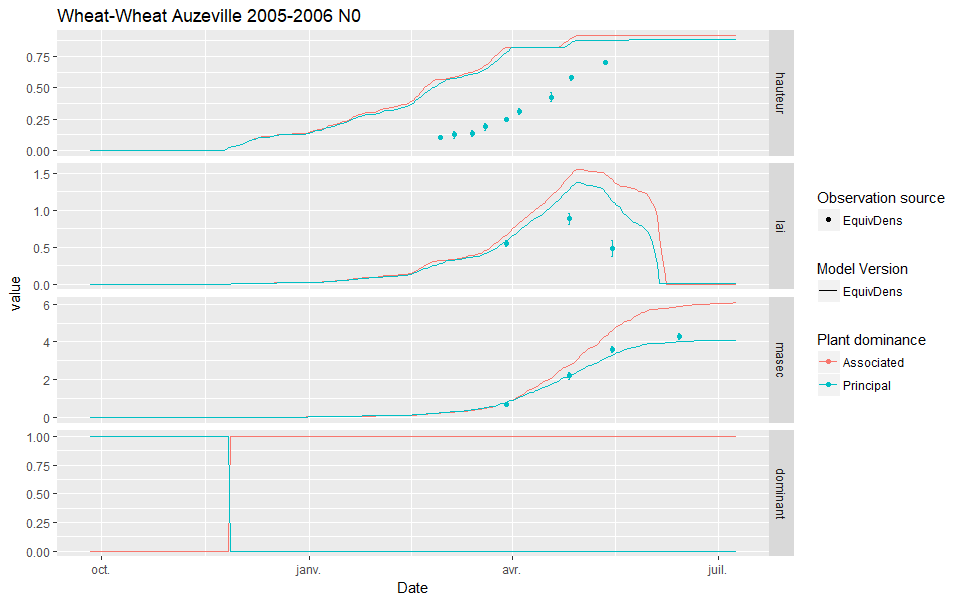
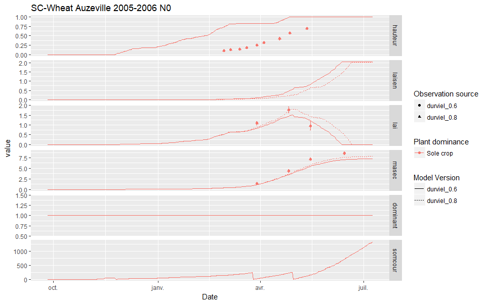
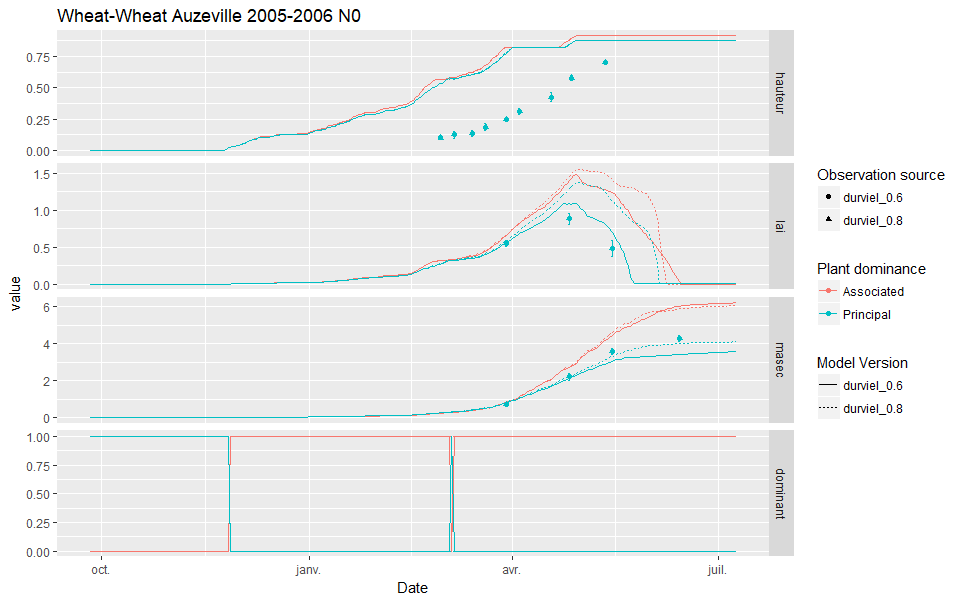

# Developpment stages and LAI dynamic {#stages}


## Introduction

Bedoussac (2009) showed the different development stages for the crops, which are reproduced in Figure \@ref(fig:stademeas)).



The STICS simulations are not in adequation with these results for the moment.

## Checking the ilev

The date of emergence is set using the `ilev` parameter. This parameter had a value of 380 in the STICS input files.

```{r eval=FALSE, message=FALSE, warning=FALSE}
read_param(dirpath = "0-DATA/Source_data/USMs/IC_Wheat_Wheat", param = "ilev") 
# 380
```

The Fig. 3 of Bedoussac (2009) shows that `ilev` should occur 151 cumulated Celsius degrees per day after sewing, but a simple computation showed us that this conditions is met on the 329th day already, and not on the 380th as previously parameterized (see computation below).

```{r eval=FALSE, message=FALSE, warning=FALSE}
# Extracting the day of sewing:
day_sewing= 
  read_param(dirpath = "0-DATA/Source_data/USMs/IC_Wheat_Wheat", param = "iplt")%>%
  as.numeric()%>%.[1]
 # 311th day of the year 2005.

# Reading the meteo file:
met= read_met("0-DATA/Source_data/USMs/IC_Wheat_Wheat")

# Computing the day on which ilev should occur, i.e. at least 151 cumulated 
# Celsius degrees per day after sewing:
met$d_jul= as.numeric(format(met$Date, "%j"))
met$Year= as.numeric(format(met$Date, "%Y"))
met%>%
  filter(Year==2005&d_jul>=311)
  mutate(cumT= ifelse(Year==2005&d_jul<day_sewing,0,(ttmin+ttmax)/2))%>%
  mutate(cumT= cumsum(cumT))%>%
  filter(cumT>=151&cumT<=155)%>%
  select(d_jul)
```

Figure \@ref(fig:ilevIC) and Figure \@ref(fig:ilevSC) shows a comparison of some STICS outputs for a wheat self-intercrop and a wheat sole crop respectively, with `ilev` set either at 380 like before or corrected at 329. The code used to make this output is as follows:

```{r eval=FALSE, message=FALSE, warning=FALSE}
Eval_stics= 
  stics_eval(dir.orig = "0-DATA/dummy/IC_Wheat_Wheat", 
             dir.targ = "2-Simulations/Stics_Exe/EquDens",
             stics = list(EquivDens= "0-DATA/stics_executable/test/stics.exe"),
             Parameter = list(ilev= list(329,380)),Plant = c(1,2),
             obs_name =  c("6_IC_Wheat1_N0.obs","6_IC_Wheat2_N0.obs"),
             Out_var = c("hauteur","laisen(n)","lai(n)","masec(n)","dominant","somcour"),
             Title = "Wheat-Wheat Auzeville 2005-2006 N0", plot_it = T)
```




The new parameter values better describe the observations for the development stages, and give simulated `lai` that are closer to the observations. However, the plant height is now increasing way too soon compared to the observations.

> These simulations were made using a version of STICS that uses the `lai` as a proxy for plant height. The model will soon be modified to compute it using other variables.


## Checking laicomp

The `laicomp` parameter is used to stop the exponential rate of `lai` growth, and is set to 0.304 for the moment.
This value could be too low compared to actual conditions, so we increased the value to 0.6 and compared the outputs in Figure \@ref(fig:laicomp)).



The new parameterization of `laicomp` gives simulated `lai` that are closer to the observations when coupling with the new parameterization of `ilev`. These two new values (`ilev`= 329 and `laicomp`= 0.6) will be kept for future simulations.

## Comparing simulated and observed lai and masec in self-IC

The simulated `masec` for each plant of wheat or pea in self-intercrop (*i.e* half the density) was rightfully compared to half the plot-scale observations. However, the `lai` was wrongly compared to the full observation value, whereas it should be compared to half its value likewise, because the full value has to be compared to the total `lai`, that is computed by summing both plants `lai`.  
The observations were then divided by two to fit the `lai` simulations outputs that correspond to each plant, so to half values.
The new outputs are shown in Figure \@ref(fig:laiobs)). The modification tells us that the plant `lai` is overestimated in self-intercrop.



## Checking durvieI

The lifespan of the early leaves is expressed as a proportion of the lifespan of the late leaves, and is called `durvieI`. This parameter help control the steepness of the decreasing part of the `lai` through leaf mortality (*i.e.* senescence).  
It appears that the leaf senescence is not well simulated in the wheat sole crop, because the `lai` do not drop as fast as in the observations. We propose to decrease the value of `durvieI` from 0.8 to 0.6. A comparison of the effect of changing this value is shown in Figure \@ref(fig:durvieISC)) for sole crop and for \@ref(fig:durvieIIC)) self-intercrop.






