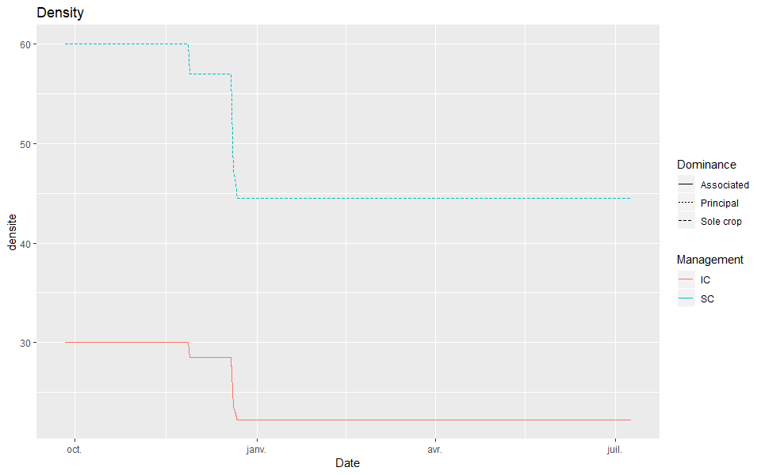

# The LAI in intercropping is too high {#LAItoohigh}

## Introduction

The `LAI` is too high compared to observations for intercropping. This is especially visible while making a self-intercrop (*i.e* wheat-wheat or pea-pea) simulation compared to a sole crop, as shown in Figure \@ref(fig:LAItoohigh).


This issue probably rise from the computation of `deltai`,  and the main hypothesis are:

* `P_dlaimax` is not well parameterized.  
* `ulai` is not well simulated in intercrop.  
* `efdensite` and `densite` are not well simulated. The value of the density used in the `deltai` equation in the self-intercrop should be half the value of the sole crop.  

The first hypothesis is rejected because the `lai` simulation is close to the measurements in the sole crop, so it should perform equally in intercrop because `P_dlaimax` should have the same value in sole crop and in intercrop. 

## Investigating the `ulai` hypothesis

Figure \@ref(fig:ulai) shows that both the sole crop (SC) and self-intercrop (IC) simulations yield approximately the same `ulai` throughout the crop cycle. This discard the second hypothesis.


## Investigating the density hypothesis

Figure \@ref(fig:densiteef) shows that the density in the Pea self-intercroping is higher than expected. The issue probably come from this.


Furthermore, we can see that the plant density is reduced twice for both Pea in SC and for the dominant plant in IC. The first is because some plants are lost in the first growing stage (`densite_lev`), and the second because of frost damage. However, the frost does not affect the associated plant density in IC. This does not reflect reality and should be changed.
The error came from a piece of code in the `senescen` subroutine where the computation differed between dominant and dominated plants.  

```{r, engine='fortran', eval=FALSE, include=TRUE}
if (ipl == 1) then
  densite = min(densite, densitelev*fgellev)
else
  densite = min(densite, (densitelev + densiteassoc)*fgellev)
endif
```

The code was changed into only one condition for both plants: 

```{r, engine='fortran', eval=FALSE, include=TRUE}
densite = min(densite, densitelev*fgellev)
```

> SHA: f525211036a7b4b683252093187298324f4cd80b

The code modification lead to better results, with an effect of frost that is equal between dominant and dominated plants as seen in Figure \@ref(fig:densitefrost).



However, an evaluation of the model on Auzeville data showed that the problem of a high `lai` persisted, so the issue did not come from this bug alone.
More investigation showed that `efdensite` was lower in self-intercrops compared to sole crop simulations, because the equivalent density of both dominant and dominated plants were set equal to the plant density or higher for the dominated plant if the difference in height is large (see Chapter \@ref(plantdensity)). However, the plant equivalent density should refer to the plant density as if it were in sole crop to have the same density effect while using sole crop parameters for `efdensite`, and not to be equal to the half-density, as it is for the moment.  
The equivalent density computation was then modified to match a density equivalent to a sole crop density, that is to say, twice the value of the sowing density in intercrop, *i.e.* the same density as if the other plant was from the same species.

As expected, the code modification led to the simulation of the same `efdensite` in SC and in IC for both plants, as seen in Figure \@ref(fig:efdensite).


