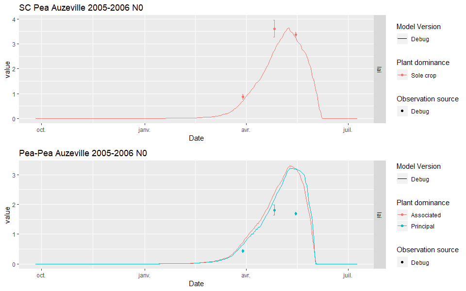
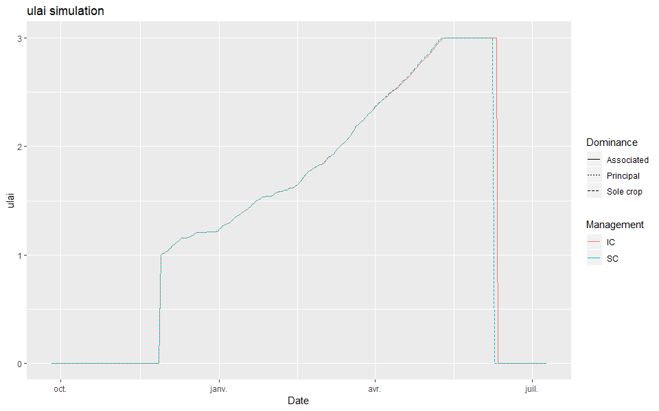
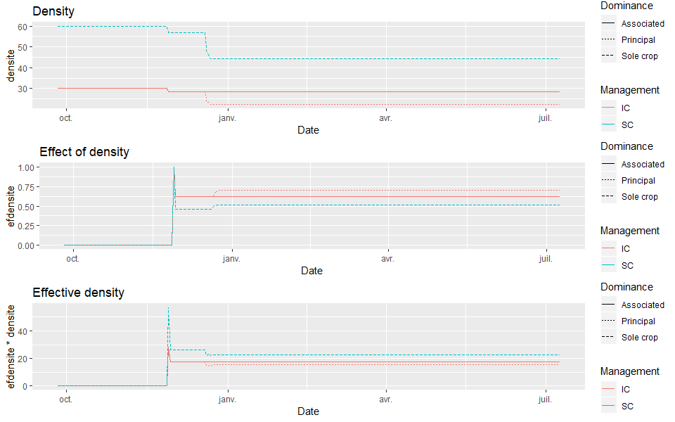

# The LAI in intercropping is too high {#LAItoohigh}

## Introduction

The `LAI` is too high compared to observations for intercropping. This is especially visible while making a self-intercrop (*i.e* wheat-wheat or pea-pea) simulation compared to a sole crop, as shown in Figure \@ref(fig:LAItoohigh).

This issue probably rise from the computation of `deltai`,  and the main hypothesis are:

* `P_dlaimax` is not well parameterized.  
* `ulai` is not well simulated in intercrop.  
* `efdensite` and `densite` are not well simulated. The value of the density used in the `deltai` equation in the self-intercrop should be half the value of the sole crop.  

The first hypothesis is rejected because the `lai` simulation is close to the measurements in the sole crop, so it should perform equally in intercrop because `P_dlaimax` should have the same value in sole crop and in intercrop. 

## Investigating the `ulai` hypothesis

Figure \@ref(fig:ulai) shows that both the sole crop (SC) and self-intercrop (IC) simulations yield approximately the same `ulai` throughout the crop cycle. This discard the second hypothesis.

## Investigating the density hypothesis

Figure \@ref(fig:densiteef) shows that the density in the Pea self-intercroping is higher than expected. The issue probably come from this.

