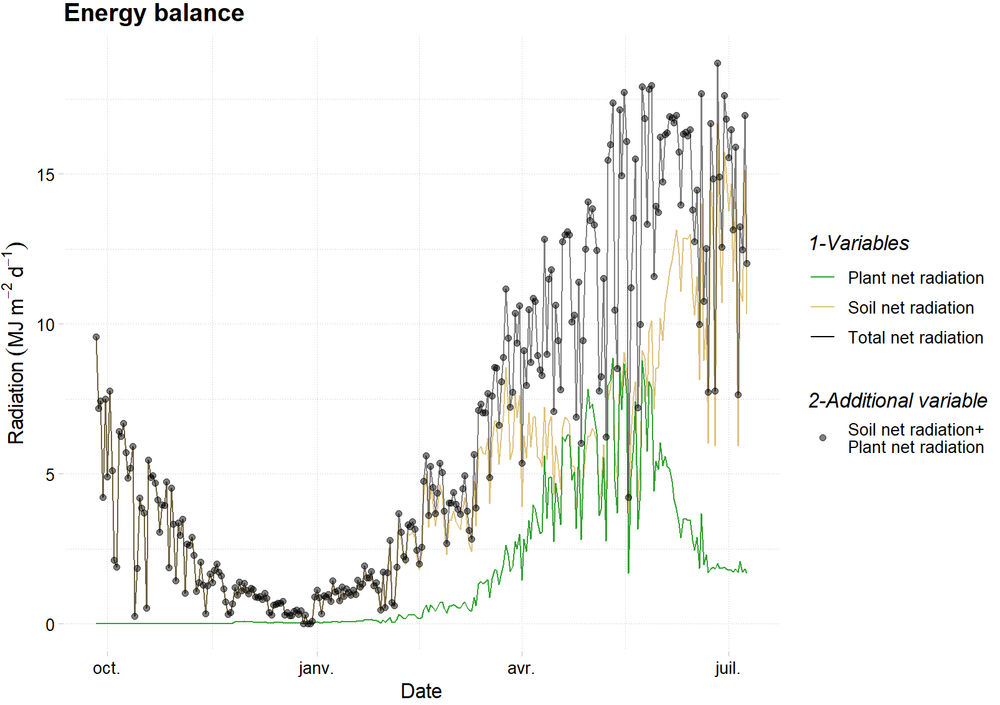
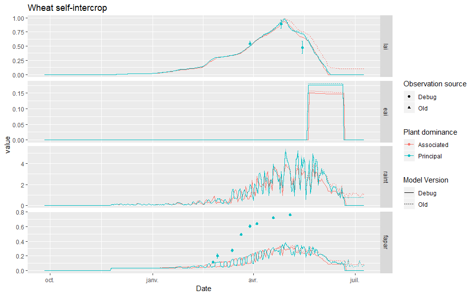

# Miscellaneous {#misc}


## Introduction

This chapter keep trace of several little issues resolved rapidly and with no high significance. 

## Extra code from transrad

Some pointless code was present in the `kgeom` subroutine in the `transrad.f90` file. The code assignated values to the `kg` variable twice in a row, and then `kg` was always recomputed anyway:

```{r, engine='fortran', eval=FALSE, include=TRUE}
if (e > 2.1e-2) then
  kg = cos(teta1)
  kg = cos(teta2)
endif

kg = 0.5 * (cos(pi/2 + teta1) + cos(pi/2 + teta2))
kg = max(kg,0.0)
```

We propose to remove the `if...endif` code bloc. The effect of the removal of this part of code was tested against the Auzeville dataset, and as expected no change was observed in the outputs.


## Sowing density in Auzeville

The sowing density in Auzeville was set to 168 for the wheat at half-density in intercropping. We change that to the real value of 140 instead.

## Energy balance

A new variable was added in STICS to keep track of the plant layers net radiation to make an energy balance. This variable is called `rnet_plant`, and is computed in the `shutwall` subroutine. It is computed using the radiation intercepted by each plant layer. The net radiation is computed as:

$rnet= rnet_{plant_1}+rnet_{plant_2}+rnet_{soil}$

Now it can be checked ad hoc using the new outputs, such as shown in Figure \@ref(fig:netradiation) that shows as expected that the net radiation output from STICS (*i.e.* `rnet`) is equal to the sum of the net radiation of the dominant (`p(1)%rnet_plant`) and dominated (`p(2)%rnet_plant`) plant as well as the net radiation from the soil (`rnetS`).




## Positive raint with zero LAI+EAI

`raint` was not equal to 0 (and so `fapar`) when the `lai`+`eai` was equal to 0, instead it remained at the last computed value when `lai`+`eai` was >0. A little modification of the model was made to fix the bug as seen in Figure \@ref(fig:bugraint). Note that a little modification on the computation of leaf senescence fix also a bug for the `lai` at the end (see e027b8efd93fe77aa7ac7242ce3496589003eb41).


