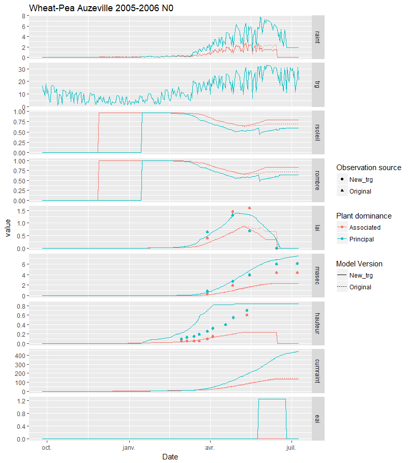

# Light incident to the dominated crop (trg) {#trg}

```{r, include=FALSE}
if(knitr:::pandoc_to() == "html") {
  knitr::opts_chunk$set(echo = TRUE)
}else{
  knitr::opts_chunk$set(echo = FALSE)
}
library(tidyverse)
library(magrittr)
```

## Computing the trg incident to the dominated plant

For the moment, STICS compute the radiation incident above the dominated (or associated) plant as:

```{r, engine='fortran', eval=FALSE, include=TRUE}
if (i > 1) c%trg(n) = trg_bak * p(i-1)%rsoleil
```

Which means that trg for the dominated plant (`i > 1`) is computed as the global atmospheric radiation, reduced by the average proportion of light intercepted by the sunlit area of the plane below the dominant plant.
This computation does not consider that the average proportion of light incident above the shaded part of the dominated plant (`rombre`) is different from `rsoleil`. See Chapter \@ref(Light) for more details. 

## Proposed solution

We propose to change this computation to take the relevant incident light according to the light regime of the dominated plant under computation:
```{r, engine='fortran', eval=FALSE, include=TRUE}
if(i > 1) then
  if(ens.eq.sc%AS) then
    c%trg(n) = trg_bak * p(i-1)%rsoleil
  else
    c%trg(n) = trg_bak * p(i-1)%rombre
  endif
endif
```

With this new computation, the radiation incident above the dominant plant depends from the component (shaded or sunlit) under consideration, and is computed using the geometry of the dominant plant (for atmospheric+transmitted light computation).

## Results

A comparison of the two was made using the [sticRs](https://github.com/VEZY/sticRs) package, from which a summary plot was extracted:


The comparison between both indicated that the dominated plant intercepted more PAR with the original computation (`raint`), due to its wrong light regime (`rsoleil` for both AS and AO). While the dry mass and height of the dominated plant did not change, its `LAI` was previously higher on the end of the rotation, which increased the `rsoleil` and `rombre` of the ground (visible as associated ones).
These simulations also showed that the wheat (dominant) `eai` was highly overestimated, which will be fixed in the next simulations. 


