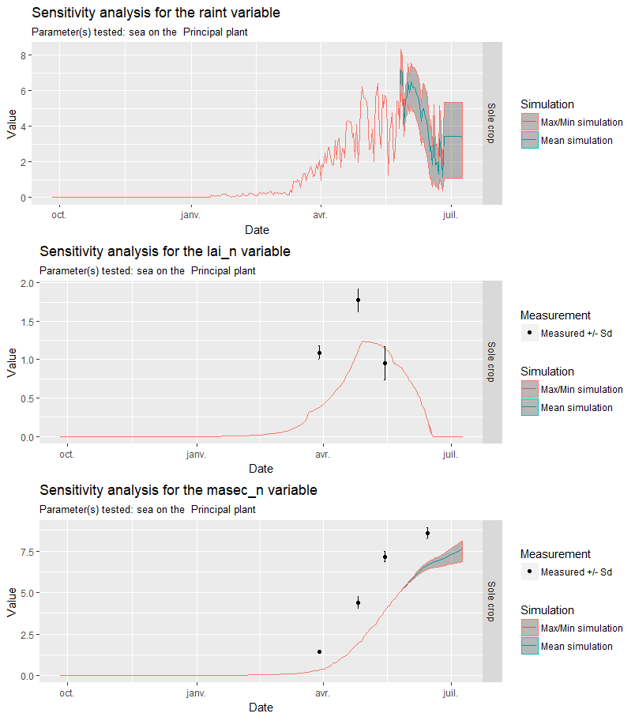

# Wheat EAI parameterization {#eai}

```{r, include=FALSE}
if(knitr:::pandoc_to() == "html") {
  knitr::opts_chunk$set(echo = TRUE)
}else{
  knitr::opts_chunk$set(echo = FALSE)
}
library(tidyverse)
library(magrittr)
```

## Introduction

The simulations outputs from Chapter \@ref(trg) have shown that the wheat ears equivalent photosynthetic surface area (`eai`) was probably overestimated by a 3-4 factor. This surface is computed using the fruit dry mass (`maenfruit`) and a parameter (`P_sea`) as follow:

```{r, engine='fortran', eval=FALSE, include=TRUE}
  eai = P_sea * maenfruit/100.
```

This parameter was originally equal to 100, meaning that each gram of fruit dry mass gave 1 m2 of equivalent `LAI`. This value was probably overestimated, but before re-parameterizing the plant, we first needed to know the model sensitivity to this parameter.

## Model sensitivity to the `P_sea` parameter

The model sensitivity was assessed using the [sticRs](https://github.com/VEZY/sticRs) package, and the results are shown below:


