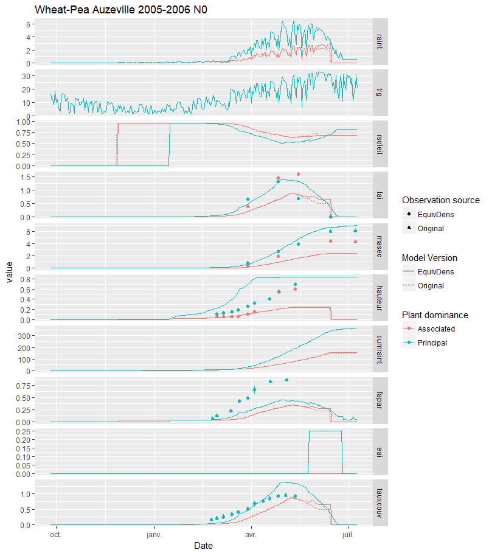

# Plant density and equivalent plant density {#plantdensity}

```{r, include=FALSE}
if(knitr:::pandoc_to() == "html") {
  knitr::opts_chunk$set(echo = TRUE)
}else{
  knitr::opts_chunk$set(echo = FALSE)
}
```

## Introduction

The plant density, which is related to the interrow distance, seems to be an important formalism to describe the crop, and particularly for mixed crops. Several computations are made to represent plant competition in the STICS model, making the density effect a complex process. Lets describe each step of the process to have a clearer representation in mind.


## The density effect on LAI

In the model, the plant density is taken as a negative effect upon the `LAI` growth as soon as a threshold of `LAI` is reached. This threshold (`P_laicomp`) represents the moment when the leaf surface of a plant start becoming competitive for light against another plant (from the same species or not). So whenever the `LAI` is higher than `P_laicomp`, the effect of the density (`efdensite`) become closer to 0 (the effect is null when equal to 1, and maximum at 0).
This effect is computed as:
$ef_{densite}=\min\left\{1.0\ ;\ e^{P_{adens}\cdot\frac{log(densiteequiv)}{P_{bdens}}}\right\}$
or more simply:
$ef_{densite}=\min\left\{1.0\ ;\ (\frac{densiteequiv}{P_{bdens}})^{P_{adens}}\right\}$

> Note: replace the equation in the model to simplify too ? 

Here is a plot representing the density effect along the equivalent density:
```{r message=FALSE, warning=FALSE}
library(tidyverse)
expand.grid(densiteequiv= 140:280, P_adens=c(-0.54,-0.7),P_bdens=c(7,10))%>%
  transmute(Parameters= paste("P_adens=",P_adens,"P_bdens=",P_bdens, sep=", "),
            densiteequiv,
            efdensite= pmin(1.0,(exp(P_adens * (log(densiteequiv/P_bdens))))))%>%
  arrange(Parameters)%>%
  ggplot(aes(x=densiteequiv))+
  geom_point(aes(y=efdensite,colour= Parameters))+
  labs(x= "Equivalent density", y= "Density effect (0-1)", colour= "a and b parameters values",
       title="Equivalent density effect on density effect")
```

So the higher the density, the higher the negative effect on `LAI`.

## The equivalent density 

In sole crops, the density effect is straightforward. However, under the case of mixed crops, the density effect can be higher for the dominated plant compared to its equivalent in sole crops. Indeed, a pea in sole crop would have a given competition with other close plants, but a different one when mixed with wheat, where the same density of wheat can give higher competition effect for light because it is taller.

Then the density effect is computed as an equivalent density instead (`densiteequiv`), that can differ from the sowing density for the dominated crop to increase the negative effect of `efdensite` compared to a sole crop.

The previous implementation in STICS was simple. The dominated plant had a doubled equivalent density compared to its actual density. After some discussion with the STICS intercrop team, Sebastian Munz modified the STICS code to implement a new formalism to define the equivalent density as a function of the height difference between the plants as follow:

$density_{Equivalent} =\begin{cases}\Delta_{height} > hauteur_{threshold} & density_{p2} + \frac{density_{p1}}{P_{bdensp1}}\cdot P_{bdensp2}  \\ \Delta_{height} < hauteur_{threshold} & density_{p2}+slope\cdot abs\left|\Delta_{height}\right| \end{cases}$

with $diffx= \frac{density_{p1}}{P_{bdensp1}}\cdot P_{bdensp2}$ and $slope= \frac{diffx}{hauteur_{threshold}}$
```{r}
df_DE= data.frame(Delta_height= seq(from= 0.01, to= 1, by= 0.01))
density_p1= 140
density_p2= 30
P_bdensp1= 7 ; P_bdensp2= 1.5
hauteur_threshold= 0.2
diffx = density_p1 / P_bdensp1 * P_bdensp2
slope= diffx/hauteur_threshold
```
Here is an exemple with a wheat-pea intercrop with a plant density of `r density_p1` for the wheat as the principal species and `r density_p2` for the pea as the associated species:
```{r}
df_DE%>%
  mutate(Equ_density= 
           ifelse(Delta_height>hauteur_threshold,
                  density_p2 + density_p1/P_bdensp1 *P_bdensp2,
                  density_p2+slope*abs(Delta_height))
  )%>%
  ggplot(aes(y= Equ_density, x= Delta_height, colour=Equ_density))+
  geom_point()+
  labs(colour = "Equivalent density",
       x = "Delta height (Dominant Plant Height-Dominated Plant Height)",
       y= "Dominated plant equivalent density",
       title= "New formalism for equivalent plant density")
```

The new formalism has several implications in the model, notably that the dominated plant is less impacted by the competition with the dominant plant when both have approximately the same height.

A comparison of the two formalisms was made using the [sticRs](https://github.com/VEZY/sticRs) package, from which a summary plot was extracted:


