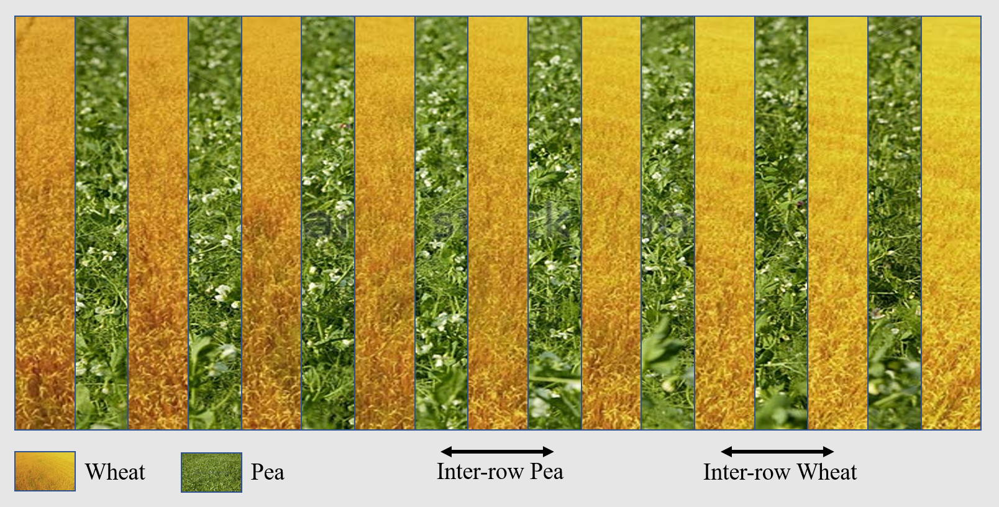

# Interrow spacing

```{r, include=FALSE}
if(knitr:::pandoc_to() == "html") {
  knitr::opts_chunk$set(echo = TRUE)
}else{
  knitr::opts_chunk$set(echo = FALSE)
}
```

## Introduction

The inter-row is the distance between two rows of the same plant species. It is straightforward for monocrops, but a bit more informative for intercrops. Indeed, the inter-row parameter can have unexpected adverse effects for intercrops. Here is a simple design with a field with two plant species sowed with the same inter-row:

<center>



</center>

So far, so good. Now what happens if we set a different inter-row spacing for the two species ? 

## Different inter-row spacing for mixed crops

Note: look for `P_interrang` in `rtrans` function (and for `P_orientrang` also) ; for `ir` in `rtrans` function. Look also to the equivalent density in `croissance()`:

```{r, engine='fortran', eval=FALSE, include=TRUE}
if (sc%P_nbplantes > 1) then
  densiteassoc = p(1)%densite / p(1)%P_bdens * p(2)%P_bdens
else
  densiteassoc = 0.
end if
```

