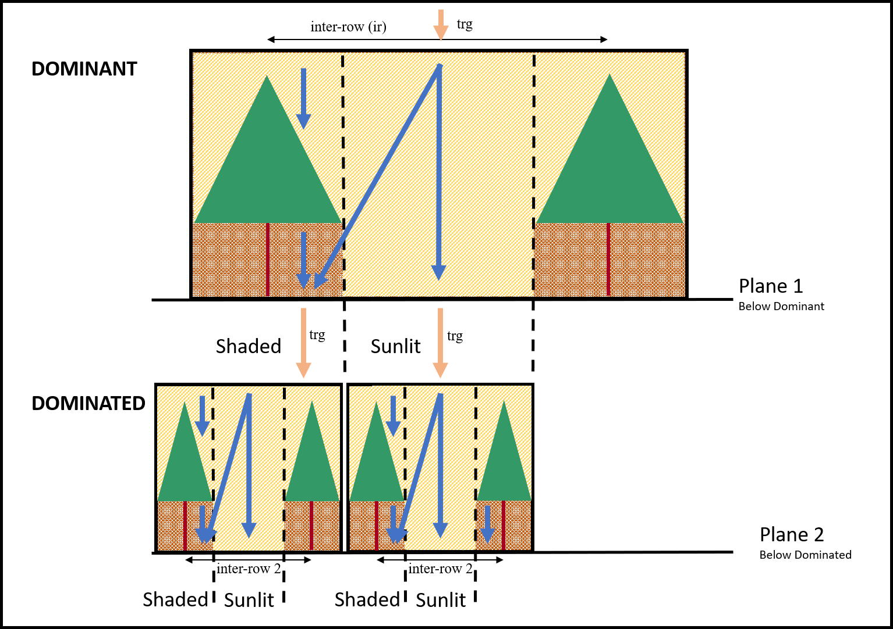

# Interrow spacing {#Interrow}

```{r, include=FALSE}
if(knitr:::pandoc_to() == "html") {
  knitr::opts_chunk$set(echo = TRUE)
}else{
  knitr::opts_chunk$set(echo = FALSE)
}
```

## Introduction

The inter-row is the distance between two rows of the same plant species. It is straightforward for monocrops, but a bit more complicated for intercrops. Indeed, the inter-row parameter can have unexpected adverse effects for intercrops. Here is a simple design with a field with two plant species sowed with the same inter-row:

<center>


</center>

So far, so good. Now what happens if we set a different inter-row spacing for the two species ? 

## Inter-row spacing for mixed crops in the model

Whereas the model as a notion of the position of the plants along the interrow considering the same plant species (*i.e.* Principal or Associated), it does not explicitly position the different plant species between each other. Indeed, the light interception of the dominant plant is first computed using its geometry and a plane at the height of the dominated plant. Then, the light interception of the dominated plant is computed using the average light incident on the previous plane (separated between shaded and sunlit component), the plant geometry, and a second plane right above the soil. So when computing its light interception, the dominated plant do not consider at all the dominant plant interrow spacing, but only the light it transmits. Of course the dominant plant interrow spacing does impact the light that is transmitted to the dominatd plant, but it is not an explicit description of the interrow spacing.

Here is a depiction of how the model describe the interrow for intercrops:



The model does effectively compute half the interrow light interception only, because it is assumed that the other half have the same light regime at daily time-scale.
First the interrow of the dominant plant is used to position the left and right dominant plants. The model then computes the golbal radiation (`trg`) that is transmitted to the Plane 1, which is then used to compute the light intercepted by the dominant plant. The light transmitted to the Plane 1 is divided into two light regimes: a shaded component (surface right under the dominant plant canopy) and a sunlit component (the opposite).

Second, the light incident on the Plane 1 is used as the `trg` for the dominated plant, and the same computation than for the dominant plant is performed for the shaded and sunlit components of the dominated plant, and then integrated at species-scale using both light interception and relative surface.

To conclude, we see that the interrow spacing can only impact the light interception as a density effect (more plants per m2, closer intra-species canopy), but not as a pure geometrical effect.

For more details on how the `trg` is computed, see Chapter \@ref(trg), and for more details on light interception, see Chapter \@ref(Light).
