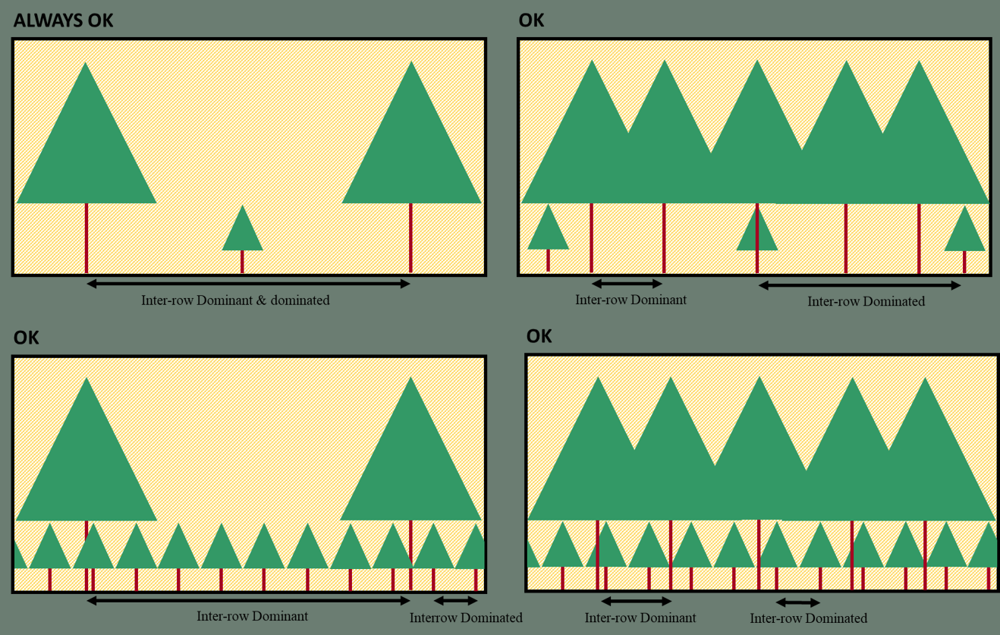
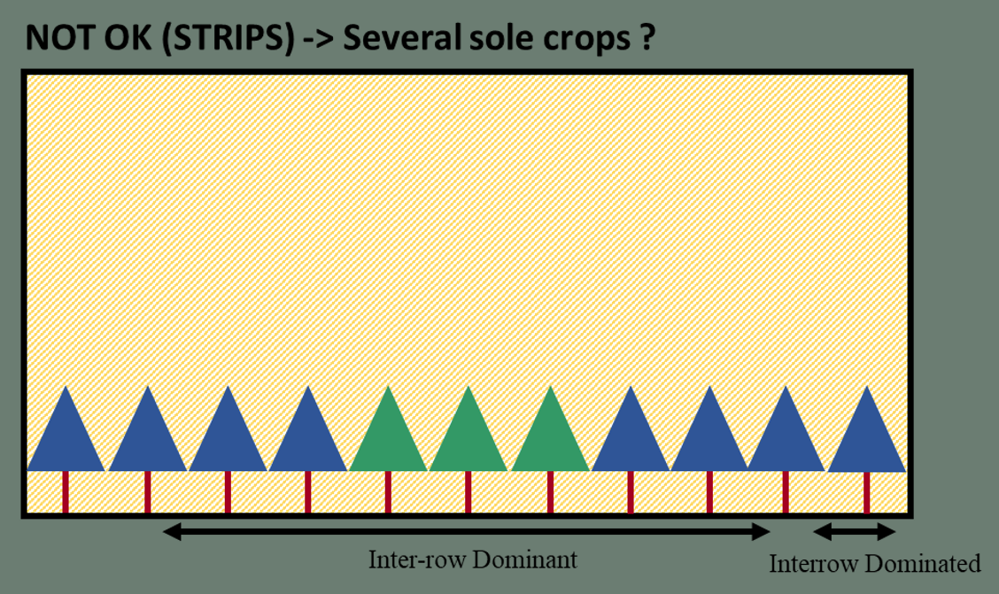

# Design

## Introduction

It is difficult to understand well which cropping design (i.e. species arrangement) can be simulated using the STICS model formalisms. Based on the previous information from Chapter \@ref(Light), \@ref(trg), and \@ref(Interrow), we present some use-cases were the model can be applied according to its formalisms, and were it cannot.
The list of designs proposed here is not exhaustive, and the user should always think about the relevance of using STICS to model a particular design.

## Designs that can be simulated

Figure \@ref(fig:DesignOK) shows the depiction of some of the cropping designs that possibly can be simulated by the STICS model. The list is not exhaustive, but gives an overall look on the possibilities:

The list will be extended soon, and the different assumptions and domain of vailidity for each will be detailed too.

## Designs that cannot be simulated

Figure \@ref(fig:DesignKO) shows a design that cannot be simulated by the STICS intercrop model as is:

Indeed, strips implies that interspecies light competition is only present on the border of each strip, making the Dominant/Dominated paradigm unreallistic for this design. The model could simulate large strips as two separated crops though.

