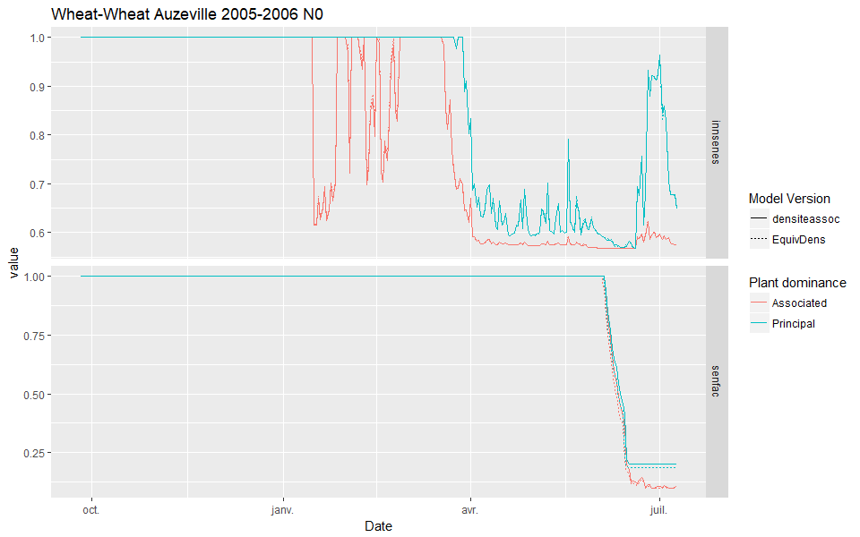

# Issue on LAI not decreasing {#LAIissue}

## Introduction

The `LAI` is not decreasing on the end of the crop cycle for the dominant plant (Figure \@ref(fig:LAIhigh)).


This issue can have different origins. The main hypothesis are:

* The leaf surface may be too high compared to their mass, coming from an abnormally high `sla`  
* A too low senescence, coming itself from a too long leaf lifespan, which could arise from a too low nitrogen mobilization (increase the lifespan), and/or a too low water stress (water stress can decrease the life span).


## Investigating the sla hypothesis

Figure \@ref(fig:LAISLA) shows that both plants (*i.e.* Principal and Associated) have exactly the same `SLA` during the growing cycle. This discard the possibility of a problem coming from a wrong `SLA` because it would be much higher for the plant with the constant `LAI` at the end of the cycle.


## Leaf senescence 

Leaf senescence is actually much lower for the plant that has a non-decreasing `LAI` (Figure \@ref(fig:Leafsen)) 


The next step is to find out why leaf senescence is too low for this plant.

### Leaf lifespan

The Figure \@ref(fig:Durvie) shows that the leaf lifespan is not much different between both plants either, rejecting our hypothesis of a too long lifespan.


However, printing the lifespan for each light environment (*i.e.* shaded, sunlit) showed that the lifespan of the shaded part of the dominated plant was equal to 0 most of the time, making `nsencours` jump from `nlev` to the first day when senescence is computed (here at day 208) at once (Figure \@ref(fig:nsencour)).


The leaf lifespan (`durvie(i)`) was computed as:

```{r, engine='fortran', eval=FALSE, include=TRUE}
if (i < fin) then
  durvie(i) = min(durvie(i), durage * min(senstress, fstressgel))
else
  durvie(i) = durage * min(senstress, fstressgel)
endif
```

The bug came from the computation of `durvie(i)` that was initialized to 0, and always equal to 0 afterward until the `fin` was reached.  
A correction is proposed to fix the bug, which make the same computation except on the first day on which the senescence is computed (`nsencour==nlev`):
```{r, engine='fortran', eval=FALSE, include=TRUE}
if (i < fin .and. nsencour > nlev) then
  durvie(i) = min(durvie(i), durage * min(senstress, fstressgel))
else
  durvie(i) = durage * min(senstress, fstressgel)
endif
```
 
The new computation fix the bug, making `nsencour` more progressive as for the dominant plant (Figure \@ref(fig:nsencourfix)).

 
 
### Stress indices

The senescence is computed using leaf life span, but also two different stress indices: `senfac` for the water stress and `innsenes` for the nitrogen stress.
Figure \@ref(fig:senstress) shows that the plant with non-decreasing `LAI` has a higher  stress compared with the other plant, rejecting again the hypothesis of a too low stress indices.




### Over-fertilization

The problem could arise from a nitrogen over-fertilization (`inn`) that could increase lifespan, but the Figure \@ref(fig:overfert) shows the contrary, with a lower `inn` for the plant with non-decreasing `LAI`.


### De-activating water and nitrogen stresses

To check if the senescence is still related to water and nitrogen stresses, Figure \@ref(fig:nostress) shows a simulation where both effects are removed (`P_codeh2oact= 2` and `P_codeinnact= 2`).


Removing the stress do not change the fact that one plant has a constant `LAI` at the end of the crop cycle. This proves that the problem does not arise from a limitation in water or nitrogen.


## The solution to the first issue

Three main variables were badly used to compute the senescence: `dltams`, `deltai` and `pfeuilverte`. These variables correspond to the daily increment in dry mass, daily increment in lai, and the green leaves proportion. The model used the values from previous computations kept in memory to compute the different components of the senescence for each light environment of the plant (*i.e.* sunlit or shaded) separately.

Unfortunately, the dominance of the plant can change over time, so a dominant plant with no shaded component can have one afterwards. If a dominant plant becomes dominated, the model was trying to use `dltams`, `deltai` and `pfeuilverte` of the shaded part of the plant that all were equal to 0 (as their initialization) because they were not computed before, making no senescence at all for the shaded part of the plant.

We propose to replace the use of a separated shaded and sunlit `dltams`, `deltai` and `pfeuilverte` by a their total at plant level, weighted by their relative surface under shaded and sunlit environment. For example, the `deltai` input to the `senescen` function would be `p(i)%deltai(0,1:sc%nbjmax)*p(i)%surf(ens)` instead of `p(i)%deltai(ens,1:sc%nbjmax))`, with `p(i)%deltai(0,n) = p(i)%deltai(sc%AS,n)* p(i)%surf(sc%AS) + p(i)%deltai(sc%AO,n)* p(i)%surf(sc%AO)`. This new computation has the advantage of considering all the lai that was incremented before, with a drawback being not to consider the previous relative surface of the plant.

Figure \@ref(fig:Newsen) shows the resulting outputs, which are more realistic.


## Fixing a second issue

After adressing the first issue, I added the new formalism to compute the equivalent density (see Chapter \@ref(plantdensity)). While studying the effect of this new formalism, I stumbled upon the same apparent issue : the `lai` was not decreasing at the end of the crop cycle. This issue came from the fact that the sharing of the `deltai` for the dominated plant between the shaded and sunlit components was too simple (see previous paragraph). Indeed, the `deltai` was weighted according to their respective surface of the current day (`n`), but the senescence can happen on different days (and it is) because both light components do not experience the same temperature conditions, so the surface effectively used to wheight `deltai` can be different from one day to another, making either the total dominated plant `deltai` too high or too low, as seen in Figure \@ref(fig:ReSen), which shows an `lai` that do not go down to 0 at the end of the crop cycle.


The issue was partially fixed by adding a temporary variable (`deltai_sencour`) to keep trace of how much and when the senescent `lai` was created, to remove it from the overall pool (new variable, `deltai_tmp`) used by the shaded component afterwards. The simulations outputs using the modified STICS are visible in Figure \@ref(fig:ReSenFixed).


This same issue was also found happening for the senescent mass, and the code was modified accordingly to correct it. However, the problem is not entirely solved, because the `lai` and `mafeuilleverte` are not going down to 0 at the end of the crop cycle yet.  
This came from the way the model compute the cumulative sunlit and shaded `deltai`, `dltaisen`, `dltams` and `pfeuilverte` at the plant level that is not compatible with their new computation anymore, because theiy already are weighted for plant level. 
For example, we computed `dltaisen`as :
```{r, engine='fortran', eval=FALSE, include=TRUE}
      p%dltaisen(0) = p%dltaisen(sc%AS) * p%surf(sc%AS) + p%dltaisen(sc%AO) * p%surf(sc%AO)
```
So now it is simply computed as:
```{r, engine='fortran', eval=FALSE, include=TRUE}
      p%dltaisen(0) = p%dltaisen(sc%AS) + p%dltaisen(sc%AO)
```

Figure \@ref(fig:ReSenFixed2) shows the results given by the modified STICS, which finally gives a `lai` and a `mafeuilleverte` equal to 0 at the end of the cycle.


