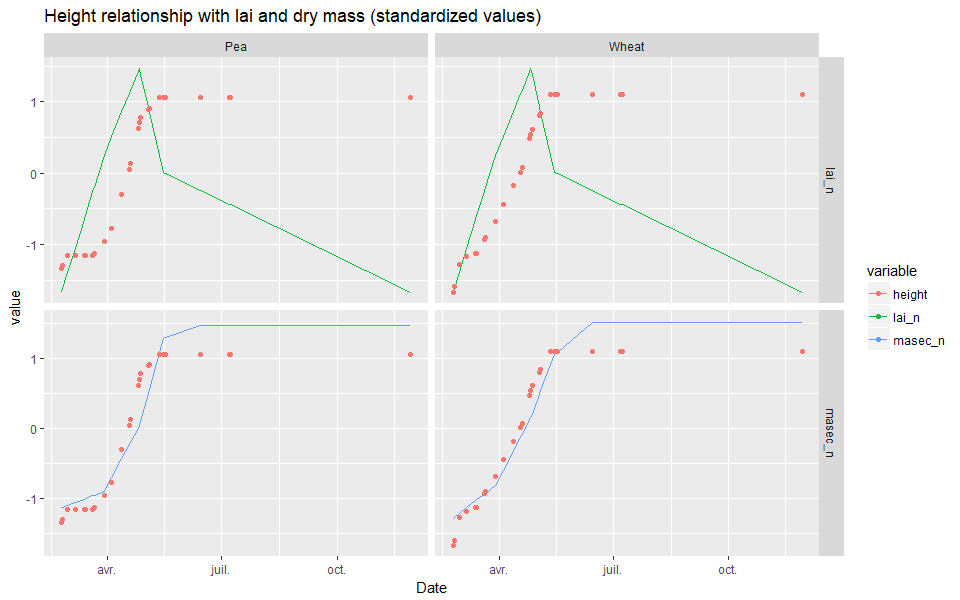

# Computing plant height {#height}


## Introduction

Plant height is not very well simulated for the moment. It is computated using the plant width, which depends itself on the plant `lai` (`lai`+`eai`+`laisen`). Please see Chapter \@ref(Light) for more details. Figure \@ref(fig:height1)) shows the simulated height of wheat in Auzeville, and the variables from which it is computed.


The plant height is important in the case of intercrops because it has high impact on the light interception of both species. 
Indeed, a sensitivity analysis was performed  using the [sticRs](https://github.com/VEZY/sticRs) package on the parameter that links the `lai` to the height: `P_rapforme`. The results are shown below (see `html` version of this book for interactivity):

```{r fig.height=11.69, fig.width=8.27, message=FALSE, warning=FALSE}
height_sensi= sticRs::load_sensi(dirpath = "data/rapforme_sensitivity")
if(knitr:::pandoc_to() == "html") {
  gg_objects= 
    lapply(height_sensi$gg_objects, 
           function(x){
             plotly::ggplotly(x, tooltip= "group")
           })
  htmltools::tagList(gg_objects)
}else{
  multiplot(plotlist = height_sensi$gg_objects)
}
```


As we can see on the above plots, as the plant `height` is affected, its `lai` is also impacted afterwards.
We can also see that no values of `P_rapforme` gave satisfactory plant height, so maybe the link between the plant `lai` and the plant `height` is not as straightforward as previously thought, and maybe there is another variable that could be better correlated to it.


## Link between height and lai and dry mass

Using the observations from Auzeville, we plotted the evolution of the plant `height` through time along the `lai` and the `masec` (*i.e.* dry mass) to see if and how they are correlated. The Figure \@ref(fig:height2)) shows this evolution with standardized and linearly interpolated observed values for all variables to make it easier to compare.



The Figure \@ref(fig:height2)) shows that the plant `height` is better correlated to the `masec` than to the `lai`. We propose to use the `masec` to compute it rather than the `lai`.

