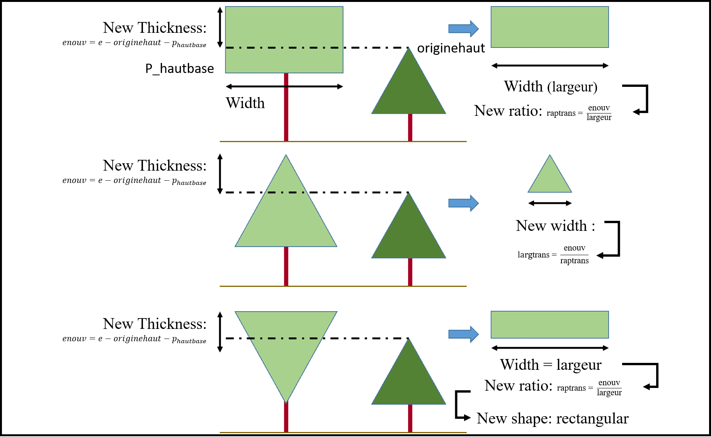
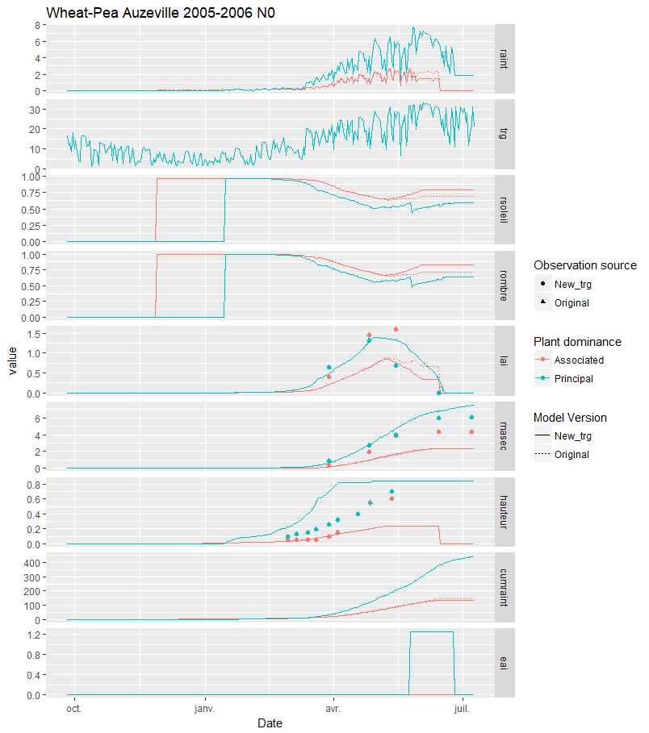

--- 
title: "Work of R.Vezy for the ReMIX Project"
author: "R. Vezy"
date: "`r Sys.Date()`"
site: bookdown::bookdown_site
documentclass: book
bibliography: [book.bib, packages.bib]
biblio-style: apalike
link-citations: yes
description: "This book is made to keep track of my work during my post-doctorate position for the ReMIX project."
---

```{r, include=FALSE}
if(knitr:::pandoc_to() == "html") {
  knitr::opts_chunk$set(echo = TRUE)
}else{
  knitr::opts_chunk$set(echo = FALSE)
}
```

# Prerequisites

Each chapter of the book should approximately match a specific objective. I first introduce the subject with a brief description, propose some solutions to the different issues and show the results. 

This book is written using the R **bookdown** package, which can be installed from CRAN or Github:

```{r eval=FALSE, include=TRUE}
install.packages("bookdown")
# or the development version
# devtools::install_github("rstudio/bookdown")
```


To compile this example to PDF, you need XeLaTeX. You are recommended to install TinyTeX (which includes XeLaTeX): <https://yihui.name/tinytex/>.

```{r include=FALSE}
# automatically create a bib database for R packages
knitr::write_bib(c(
  .packages(), 'bookdown', 'knitr', 'rmarkdown'
), 'packages.bib')
```


```{r setup, include=FALSE}
# Add a common class name for every chunks
knitr::opts_chunk$set(
  echo = TRUE)
```


<!--chapter:end:index.Rmd-->


# Light Interception {#Light}

```{r, include=FALSE}
if(knitr:::pandoc_to() == "html") {
  knitr::opts_chunk$set(echo = TRUE)
}else{
  knitr::opts_chunk$set(echo = FALSE)
}
```

## Introduction

In STICS, the light interception is either computed using a simple Beer law assuming a homogeneous, turbid canopy, or a radiation transfer model that consider the plants leaf area index, canopy shape, height and density. The Beer law option is very simple but generally fairly accurate for high density homogeneous crops, but may rapidly yield unsatisfying predictions for stands with higher structural complexity (e.g. perennial plantations or mixed crops). For mixed crops, the model uses the radiation transfer model in a particular manner that is described in further details below.

For the case of intercrops, the model first set the taller crop as "dominant", and the shorter crop as "dominated". The model then compute the radiation interception of each one according to the dominancy, the structure (height, width, light extinction coefficient...) and position (interrow distance, row orientation) of the species. Of course, the dominancy of each plant species can be inverted if the dominated plant become taller than the dominant plant, and the model checks every day for such a case.

```{r stand initialization}
j=1              # julian day (DOY= Day Of Year)
ir= 1            # Interrow distance
l= 0.2           # Width of the plant crown
rap= 0.5         # Thickness to width ratio
haut= 1.         # Height of the part of the dominant plant above the dominated plant
                 # = hauteurzero = P_hautbase-originehaut
                 # with originehaut= dominated plant height
P_forme= 1       # Plant shape code (1= rectangle, 2= upside triangle, 3= downside tr.)
alpha= 0         # Row orientation
lat= 43.61       # Latitude in degrees
trg= 25          # Global radiation
rdif= 0.4        # Diffuse fraction of the atmospheric radiation
P_ktrou= 0.2     # Light extinction coefficient of the dominant plant
lai= 2           # Leaf area index of the dominant plant
eai= 0           # Equivalent leaf area index, = photosynthetic surface that is not from
# leaves (e.g. wheat ears, rapeseed siliquae, pea pods or grapes during their green stage)
```

To facilitate understanding, we will use a common intercrop example throughout the whole document. We take a mixed crop simulated for the day of the year `r j` with a global radiation of `r trg` MJ m-2 day-1 (= `r trg*0.48` MJ m-2 day-1 of PAR), and a diffuse fraction of light of `r rdif`, an interrow spacing of `r ir` meter, a shape of `r P_forme` (1= rectangle, 2= upside triangle and 3= downside rectangle), a canopy width of `r l` meter, a canopy thickness of `r l*rap` meter, a row orientation of `r alpha` relative to the North-South axis at latitude `r lat` degrees north, an LAI of `r lai`, a light extinction coefficient of `r P_ktrou`. The canopy of the dominant plant is `r haut` meter above the dominated plant.
All code used in this document can be viewed in each section by clicking on the `Code` button on the right.

## Plant shape

Each plant radiation interception is computed using an approximation of its shape (`P_forme`= 1, rectangle, = 2 upside triangle, = 3 downside triangle), leaf area index (`lai` or `p(i)%lai(ens,n)`), height, width, density at emergence and leaf area density (`dfol`).

### Plant width computation

First, the plant width is computed using the `formplante` function. This computation is possible thanks to the relationship between two ways for computing the plant leaf area, where one of them uses the plant width:

* First, assuming the plant has a square footprint (i.e. plant projection is square), we can find the plant leaf area using the leaf area index (`lai`) and the plant density:   
$LA=\frac{\left(lai+laisen+eai\right)}{densite}$  which is the equivalent to:   $LA=\left(lai+laisen+eai\right)\cdot interrang\cdot distrang$  
where `lai` is the leaf area index, `laisen` is the senescent leaf area index, `eai` is the equivalent leaf area of the photosynthetic organs that are not leaves (e.g. flower buds), `interrang` is the inter-row spacing and `distrang` the intra-row distance.

* Second, using the leaf area density and the plant volume such as:  
$LA=dfol\cdot largeur\cdot epaisseur\cdot profondeur$ for a cuboid and $LA=dfol\cdot\frac{1}{2}\cdot\left(largeur\cdot epaisseur\cdot profondeur\right)$ for a triangular prism, where `dfol` is the leaf area density, `largeur` is the **plant width** (also called `largtrans`), `epaisseur` is the plant thickness and `profondeur` is the plant depth.

Knowing both equations, and assuming the two following hypothesis:

1. The plant depth is equal to the plant width
2. The intra-row distance between two plants is equal to the plant width 

We can now compute the plant width as:  
$largeur=\sqrt{\frac{(lai+laisen+eai)\cdot interrang}{dfol\cdot varrapforme}}$

where `varrapforme` (or `raptrans` further) is the ratio between the plant thickness and width and is computed as $varrapforme=\frac{(hauteur-P_{hautbase})}{largeur}$ where `hauteur` is the total plant height, `P_hautbase` is the plant (i.e. crown) base height and `largeur` is the plant width (see fig \@ref(fig:Width) for more details)


### Plant width correction

If the dominated plant is higher than the base height of the dominant plant, the radiation interception of the dominant plant is partially reduced, by reducing the volume that can intercept light to the canopy volume above the dominated plant only. This correction is made to consider the competition for light between the two species, and is computed according to the shape of the plant.

Consequently, the model first compute the height of the dominated plant (`sc%originehaut`) by looking for the maximum height between the sunlit and shaded part of the dominated plant:  
`sc%originehaut = max(p(i+1)%hauteur(sc%AO),p(i+1)%hauteur(sc%AS))`

> `sc%originehaut` is fixed to `0` (= soil) while computing the dominated plant.

Hence, the new thickness (`enouv`) is computed as:   $enouv=largeur\cdot\left|varrapforme\right|+hauteurzero$, and is used to re-compute the shape of the plant:

* The new thickness to width ratio (`raptrans`, formerly `varrapforme`): $raptrans=\frac{enouv}{largeur}$ for rectangle shaped plants,
* The new width (`largtrans`, formerly `largeur`): $largtrans=\frac{enouv}{varrapforme}$ for upsided triangle shaped plants,
* The new width (`largtrans`, formerly `largeur`): $raptrans=\frac{enouv}{largtrans}$ for downsided triangle shaped plants,

All variable names are changed, whether there is a correction or not. Here is a summary table:

```{r varmatch, echo = FALSE, results = 'asis'}
library(knitr)
kable(data.frame(Origin= c("hauteur",'largeur',"varrapforme","enouv"),
                 Modified= c("hauteur","largtrans","raptrans","enouv"),
                 Translated= c("Height", "Width","Thickness/Width Ratio","Thickness")),
      caption = "Variable name modification in the formplante function",
      col.names = c("Original", "Modified","Definition"))
```


> Upside triangle is a triangle with its base at the bottom, while downside triangle is a triangle with the base at the top.  

The correction of the shape of the plant can be summarised in the following diagram  (\@ref(fig:Comprad)):




The correction of the shape of the plant is only used to compute the light transmitted to a plane at the dominated plant or soil height. The targeted plant interception is computed using its whole leaf area index and a light extinction coefficient.   

## Light interception

The light intercepted by a plant species is obtained by computing the light reaching a horizontal plane below its canopy, either at the height of the dominated plant (for the dominant plant) of the soil (for the dominated plant). Therefore, the light incident on this plane is either coming from:  

* The incident light coming from the atmosphere, divided into two components, namely the diffuse and direct light. This light is called `rdroit` in the model,
* The light transmitted by the dominant crop, which is called `rtrans`, and that is generally of lower quality for photosynthesis. The effect of light quality is wrapped in the equivalent density formalism, see \@ref(plantdensity) for more details.

Consequently, numerous points (20, or 200 if the inter-row is lower than 1 m) are equally distributed every meter along the inter-row (*i.e.* one point every 5 cm, or every 0.5 cm with 200 points), at the height of the plane. These points are used to discretize the computation of the incident light at the surface of the plane.  
Hence, the total number of points to simulate is computed using the `interval` parameter, which is equal to 200 if the inter-row is lower than 1 meter or 20 if more. It is then used to compute the total number of points to simulate as: $N_{points}=\frac{ir}{2}\cdot interval$

>In practice, the model really simulates only half of the inter-row, because it is considered that the other half have the same light conditions at daily time-scale. For example, if we take an interrow of 10 meters, the model simulates 100 points equally distributed from 0 to 5 meters.

Here is an example of the X position on the plane, starting from the left-hand side of the row, using an inter-row spacing of `r ir` meter and a plant width of `r l` meter:

```{r x_interval, echo = TRUE, results = 'asis'}
if(ir<1.0){
  interval = 200
}else{
  interval = 20.
}
i= 1:(ir / 2 * interval)
x= (i-1) / interval
cat(paste("x=", paste(x, collapse = ", ")))
```

The points are then divided into two groups :

* The sunlit points, which are located directly under the crown of the targeted crop. 
* The shaded points, which are not directly under the crop crown, *i.e.* they have the sky above them.  

Then the semi-hemisphere above each point is discretized onto 2 x 23 angles: 23 angles from top to right, and 23 angles from top to left.
These angles are used to compute `kgdiffus`, the atmospheric diffuse radiation incident to the X point. However, if the X point is below the targeted crop canopy (`X<l/2`), only the 23 angles from the top to the right are used to compute `kgdiffus` (considering that Xs are only computed from the left-hand plants row until the middle of the inter-row, see fig.\@ref(fig:Compdominated) for more details).  

The model determines the two angles ($\theta_1$ and $\theta_2$) between which the point only receive incident light coming from the atmosphere (`rdroit`). Using these two angles (or their tangent, `G`), the model computes: 

1. The daily direct radiation (i.e. cumulated hourly radiation) that is incoming only during the time period between two hours (`h1` and `h2`) when the sun angle is between $\theta_1$ and $\theta_2$. Function `kgeom` called in `rtrans`.
2. The incident diffuse radiation for all angles between $\theta_1$ and $\theta_2$. Function `kdiff` called in `rtrans`.
3. The light transmitted to the plane by the target crop for all angles below $\theta_1$ or above $\theta_2$.

> In practice, all points with an x position lower than $\frac{largeur}{2}$ are shaded, and all other are sunlit, so the model computes the diffuse radiation coming from the atmosphere only for one quarter of the hemisphere for shaded Xs ; the other quarter will receive transmitted light because all angles are superior to $\theta_2$.

> Main functions used are `transrad`, `rtrans`, `kdiff` and `kgeom`.

The position of $\theta_1$ and $\theta_2$ (and their tangent) depends from three components: the crop shape, its inter-row spacing, and the sun azimuth (see fig. \@ref(fig:Compdominated)).


### Incident direct radiation from the atmosphere

The incident direct radiation for each X point is computed for all angles of the hemisphere between $\theta_1$ and $\theta_2$ (see \@ref(fig:Compdominated)), and summed up to integrate the semi-hemisphere of each point.

Here is an example of the computation of the direct proportion received at each X point for a crop using the `kgeom()` function:

```{r kdir, echo = TRUE, results = 'asis'}
decangle= function(j){
  theta1 = 2 * pi * (j - 80) / 365
  theta2 = 0.034 * (sin(2 * pi * j / 365) - sin(2 * pi * 80 / 365))
  theta = theta1 - theta2
  decangle = asin(0.3978 * sin(theta))
}

thetacrit= function(lat,j,tgh,alpha){
  
  acrit = 0.0
  bcrit = 0.0
  a = 0.0
  b = 0.0
  thetacr = 0.0
  hcritprec= 0
  n  = 3
  dec = decangle(j)
  hprec = 0.0
  pi = 4 * atan(1.0)
  theta= rep(0,180)
  
  for(i in 1:(18 * n)){
    theta[i] = 10. / n * (i - 1)
    theta[i] = (theta[i] - 90) / 180 * pi
    # Sun position (h,azim)
    sinh = sin(lat) * sin(dec) + cos(lat) * cos(dec) * cos(theta[i])
    h = asin(sinh)
    cosazim = (-cos(lat) * sin(dec) + sin(lat) * cos(dec) * cos(theta[i])) / cos(h)
    cosazim = pmin(1.0,cosazim)
    if(theta[i]!=0.0){
      azim = acos(cosazim) * theta[i] / abs(theta[i])
    }else{
      azim = 0.0
    }
    if(sinh<0.0){h = 0.0}
    
    # Critical height
    hcrit = atan(tgh * abs(sin(azim + alpha + 0.00001)))
    # test for h = hcrit
    if (hcritprec >= hprec & hcrit <= h & i > 1){
      # Linear interpolation:
      acrit = (hcrit - hcritprec) / (theta[i] - theta[i-1])
      bcrit = hcrit - acrit * theta[i]
      a = (h - hprec) / (theta[i] - theta[i-1])
      b = h - a * theta[i]
      
      if(a!=acrit){thetacr = (b - bcrit) / (acrit - a)}
      hcritprec = hcrit
      hprec = h
    }
  }
  return(thetacr)
}

e = abs(l * rap) # Thickness of the plant crown
xprec= 0         # Init.
limite = l / 2

if(ir<1.0){interval = 200.}else{interval = 20.}
if(l>ir/2.){l = ir/2.}

if(e>0.0){
  limite2 = l/2 * (haut/e+1)
}else{
  P_forme = 1
}
# NB : is it sure that it is (haut/e+1) and not (haut/(e+1)) ? 

# Saving some intermediate results for output here (not in the real function):
x_s= (1:(ir / 2 * interval))
Output= data.frame(x_index= x_s,
                   x_value= (x_s-1)/interval,
                   theta1= rep(NA_real_,length(x_s)),
                   theta2= rep(NA_real_,length(x_s)),
                   theta1_deg= rep(NA_real_,length(x_s)),
                   theta2_deg= rep(NA_real_,length(x_s)),
                   kg= rep(0,length(x_s)))

# Loop over Xs:

for(i in x_s){
  x = (i-1) / interval
  if(xprec<=l/2&x>=l/2){ilim = i}
  xprec = x
  
  # kdir:
  
  # Rectangle:
  if(P_forme==1){
    tgh1 = (haut + e) / (ir - x - limite)
    theta1 = thetacrit(lat,j,tgh1,alpha)
    if(x>limite){
      tgh2 = (haut + e) / (x - limite)
      theta2 = thetacrit(lat,j,tgh2,alpha)
    }else if(x < limite){
      tgh2 = haut / ( -x + limite)
      theta2 = -thetacrit(lat,j,tgh2,alpha)
    }else{
      # x == limite
      theta2 = 0
    }
  }
  
  # Downside Triangle:
  if (P_forme==2 & rap<0.){
    tgh1 = (haut + e) / (ir - x - limite)
    theta1 = thetacrit(lat,j,tgh1,alpha)
    if (x > limite){
      tgh2 = (haut + e) / (x - limite)
      theta2 = thetacrit(lat,j,tgh2,alpha)
    }else if(x < limite){
      tgh2 = (haut + e) / ( x - limite)
      theta2 = -thetacrit(lat,j,tgh2,alpha)
    }else{
      theta2 = 0
    }
  }
  
  # Upside Triangle:
  if (P_forme==2&rap>0.){ then
    tgh1 = (haut + e) / (ir - x - limite)
    theta1 = thetacrit(lat,j,tgh1,alpha)
    if (x < limite2){
      if (x > limite){
        tgh2 = haut / ( x - limite)
        theta2 = thetacrit(lat,j,tgh2,alpha)
      }else if(x < limite){
        tgh2 = haut / (limite - x)
        theta2 = -thetacrit(lat,j,tgh2,alpha)
      }else{
        theta2 = 0.0
      }
    }else if(x >= limite2){
      tgh2 = (haut + e) / x
      theta2 = thetacrit(lat,j,tgh2,alpha)
    }
  }
  
  # NB: is there a missing else here ? kg is modified just after...
  if(e > 2.1e-2){
    kg = cos(theta1)
    kg = cos(theta2)
  }
  kg = 0.5 * (cos(pi/2 + theta1) + cos(pi/2 + theta2))
  kg = max(kg,0.0)
  
  Output$theta1[Output$x_index==i]= theta1
  Output$theta2[Output$x_index==i]= theta2
  Output$kg[Output$x_index==i]= kg
}

Output$theta1_deg= (pi/2+Output$theta1)*180/pi
Output$theta2_deg= (pi/2-Output$theta2)*180/pi

colnames(Output)= c("X index","X value (m)","Theta 1 (rad)","Theta 2 (rad)",
                    "Theta 1 (deg)","Theta 2 (deg)","kgdirect")

kable(Output, caption= paste("Example of the computation of the incident direct",
                             "radiation ratio kgdirect. See introduction section",
                             "for further details on the crop."))
```

Where $\theta_1$ and $\theta_2$ are the angles visible in [fig.3](#fig:Compdominated) and kgdirect the proportion of the semi-hemisphere that receive direct light, considering sun position throughout the day by using stand latitude, day of year and row orientation. In the model, $\theta_1$ and $\theta_2$ are computed in radian relative to the vertical plane above X. To provide a simpler representation, $\theta_1$ and $\theta_2$ are also given in degrees relative to the horizontal plane (i.e. soil or dominated plant species surface) in tab.\@ref(tab:kdir).

### Incident diffuse radiation from the atmosphere

The incident diffuse radiation for all angles between $\theta_1$ and $\theta_2$ is computed using `G`, the apparent tangent to the considered $\theta$. First the model computes it for $\theta_1$, and uses it as a threshold under which no diffuse radiation comes from the atmosphere because only transmitted radiation reaches this angle for the considered X point. Second, the model tests if the X point is below the target crop canopy, and if not it computes `G` for $\theta_2$, and applies the same methodology, with `G` being the upper threshold this time. This method avoids computing the left-hand quarter of the hemisphere since it receives only transmitted light necessarily if it is under the targeted crop.

Here is an example of the computation of the diffuse proportion received at each X point for the same crop as above (interrow= `r ir` meter, width= `r l` meter, thickness= `r l*rap` meter, height= `r haut` meter) using the `kdif()` function:

```{r kdiff, echo = TRUE, results = 'asis', fig.cap= "Example of the computation of the incident diffuse radiation ratio kgdiffus for each angle of the semi-hemisphere."}
# Initializations:
htab= c(9.23, 9.23, 9.23, 9.23, 9.23, 10.81, 10.81, 26.57,
        26.57, 26.57, 31.08, 31.08, 31.08, 31.08, 31.08, 47.41,
        47.41, 47.41, 52.62, 52.62, 69.16, 69.16, 69.16)
aztab= c(12.23,59.77,84.23,131.77,156.23,36,108,0,72,144,23.27,48.73,95.27,
         120.73,167.27,0,72,144,36,108,0,72,144)
SOCtab= c(0.0043, 0.0043, 0.0043, 0.0043, 0.0043, 0.0055,
          0.0055, 0.0140, 0.0140, 0.0140, 0.0197, 0.0197,
          0.0197, 0.0197, 0.0197, 0.0336, 0.0336, 0.0336,
          0.0399, 0.0399, 0.0495, 0.0495, 0.0495)
xprec= 0

if(ir<1.0){interval = 200.}else{interval = 20.}
if(l>ir/2.){l = ir/2.}

# Saving some intermediate results for Output_diff here (not in the real function):
x_s= (1:(ir / 2 * interval))
Output_diff= data.frame(x_index= rep(x_s,each=23),
                   x_value= rep((x_s-1)/interval,each=23),
                   Angle = rep(1:23, length(x_s)),
                   G1= rep(NA_real_,length(x_s)*23),
                   G2= rep(NA_real_,length(x_s)*23),
                   hcrit= rep(0,length(x_s)*23),
                   kgdiffus= rep(0,length(x_s)*23))


# Loop over Xs:

for(i in x_s){
  x = (i-1) / interval
  if(xprec<=l/2&x>=l/2){ilim = i}
  xprec = x
  
  # kdif:
  
  x = min(x,ir/2)
  e = abs(l*rap)
  kgdiffus = 0.
  
  # Computing for the right-hand of the row:
  G1 = (haut+e)/(ir-x-l/2.) # the apparent tangent h1
  for(j in 1:23){
    hcrit = atan(G1*sin(aztab[j]/180*pi))/pi*180
    if(hcrit<htab[j]){
      kgdiffus = kgdiffus+SOCtab[j]
      ######## Not in the real function ########
      Output_diff$kgdiffus[Output_diff$x_index==i&Output_diff$Angle==j]= SOCtab[j]
      ##########################################
    }
    ######## Not in the real function ########
    Output_diff$hcrit[Output_diff$x_index==i&Output_diff$Angle==j]= hcrit
    Output_diff$G1[Output_diff$x_index==i&Output_diff$Angle==j]= G1
    ##########################################
  }
  
  # Computing for the left-hand row, if the point is not a shaded point:
  if(x>l/2){
    G2 = (haut+e)/(x-l/2) # the apparent tangent h2
    for(j in 1:23){
      hcrit = atan(G2*sin(aztab[j]/180*pi))/pi*180
      if(hcrit < htab[j]){
        kgdiffus = kgdiffus+SOCtab[j]
        ######## Not in the real function ########
        Output_diff$kgdiffus[Output_diff$x_index==i&Output_diff$Angle==j]= 
          Output_diff$kgdiffus[Output_diff$x_index==i&Output_diff$Angle==j]+SOCtab[j]
        ##########################################
      }
      ######## Not in the real function ########
      Output_diff$hcrit[Output_diff$x_index==i&Output_diff$Angle==j]= hcrit
      Output_diff$G2[Output_diff$x_index==i&Output_diff$Angle==j]= G2
      ##########################################
    }
  }
}

colnames(Output_diff)= c("X index","X value (m)","angle","G1 (tangent)",
                         "G2 (tangent)","hcrit","kgdiffus")
if(knitr:::pandoc_to() == "html") {Output_diff}else{
  kable(Output_diff[1:10,],
        caption = paste("Computation of the diffuse light incident on each",
                        "point x. Ten first rows only, for the full data,",
                        "please refer to the html version of this book"),
        col.names = c("X index","X value (m)","angle","G1 (tangent)",
                      "G2 (tangent)","hcrit","kgdiffus"), longtable = TRUE)
}
```

The total diffuse radiation incident to each point X is simply the cumulative of each angle:

```{r kdifftot, echo = TRUE, results = 'asis'}
suppressWarnings(suppressPackageStartupMessages(library(dplyr)))
Output_diff%<>%
  group_by(`X index`)%>%
  summarise(kgdiffus= sum(kgdiffus))

kable(Output_diff,caption= paste("Example of the computation of the incident diffuse",
"radiation ratio kgdiffus. See introduction section for further details on the crop."))
```

### Total diffuse and direct radiation from the atmosphere incident to each X point

The total radiation from the atmosphere incident to each X point is computed by using the incident diffuse (`rdif`) and direct (`rdirect`) radiation coming from the atmosphere weighted respectively by the previously computed `kgdiffus` and `kgdirect` as follow:
$rdroit=(kgdiffus\cdot rdif)+(kgdirect\cdot rdirect)$

### Light tramsitted by the dominant crop to the X points

The light transmitted by the dominant crop to the dominated crop (`rtransmis`) is computed using the total radiation from the atmosphere incident to each X point (`rdroit`) and the effective targeted plant leaf area index as follow:

$rtransmis=(1.0-rdroit)\cdot e^{-P_{ktrou}\cdot(lai+eai)}$

where $P_{ktrou}$ is the targeted plant light extinction coefficient, `lai` the plant leaf area index, and `eai` the equivalent leaf area index, which represent the photosynthetic surface that is not from leaves (e.g. wheat ears, rapeseed siliquae, pea pods or grapes during their green stage).

### Total light incident to X points

The total light incident to each X point is the sum of the three components: atmospheric diffuse light, atmospheric direct light and transmitted light by the dominant crop.
Taking our previous example again, this computation leads to:

```{r}
rdirect= 1-rdif
rdroit= (Output_diff$kgdiffus*rdif)+(Output$kg*rdirect)
rtransmis = (1.0 - rdroit) * (exp(-P_ktrou * (lai + eai)))

incident_light= 
  data.frame(Output[,1:2],Total=rdroit+rtransmis, rdroit,rtransmis, 
             light_env= ifelse(Output$`X value (m)`<limite,"Shade","Sun"))
kable(incident_light,
      col.names = c("X index","X value (m)","Total incident ratio",
                    "Atmospheric ratio","Transmitted ratio","Light environment"),
  caption=paste("Example of the computation of the total incident radiation ratio.",
                "See introduction section for further details on the crop."))
```

### Total radiation incident to the plane

The ratio of the radiation incident to the plane is computed separately for its so-called sunlit and shaded components, giving for our previous example:

```{r}
incident_light%<>%
  group_by(light_env)%>%
  summarise(Total= mean(Total))

kable(incident_light, 
      col.names = c("Plane light environment", "Total incident light ratio"),
      caption= paste("Example of the computation of the total incident radiation",
                     "ratio for each light environment for a horizontal plane below",
                     "the targeted plant canopy. See introduction section for further",
                     "details on the crop."))
```
      
Finally, both ratios are used to compute the intercepted PAR `raint` (MJ m-2 d-1) of the target plant as:  
$raint=P_{parsurrg}\cdot trg\cdot(1-(rombre\cdot surfAO)-(rsoleil\cdot surfAS))$  
where $P_{parsurrg}$ is a coefficient to compute PAR (Photosynthetically Active Radiation) from the global radiation, `trg` is the active radiation (either RG or radiation transmitted below the dominant crop), `rombre` and `rsoleil` are the ratio of incident light for shaded and sunlit components of the plane, and `surfAO` and `surfAS` are the relative surface (0 to 1) of the shaded and sunlit components of the plane.

```{r message=FALSE, warning=FALSE}
library(tidyverse)
library(magrittr)
P_parsurrg= 0.5
incident_light%<>%spread(light_env,Total)
surfAO = l/ir
surfAO = min(surfAO,1.0)
surfAS = 1.0 - surfAO
raint = P_parsurrg * trg * (1 - (incident_light$Shade * surfAO) - (incident_light$Sun* surfAS))
```

For our example, the crop would have intercepted `r round(raint,2)` MJ m-2 day-1 of radiation.

Note: The relative surfaces (0 to 1) of the shaded and sunlit components of the plane (`surfAO` and `surfAS`) that are computed during the dominant plant computation are then used as the shaded and sunlit surfaces for the dominated plant.


## Conclusion

The interception of the targeted plant is obtained by:

1. Computing the light that is incident at a horizontal plane at the height of the dominated plant (or the soil) and,
2. Substracting this incident light to the global PAR (or the transmitted PAR for the dominated plant), which gives the PAR intercepted by the target plant.

This process is applied iteratively to the dominant and the dominated plant to compute both species PAR interception while taking account for their respective structure (shape, height, width...).

## Further details

The dominated plant interception is computed in two separate computations, one for the sunlit component, and one for the shaded component, and interception is then weighted by their relative surface. The dominant plant is considered having 100% of its surface that is sunlit, so all this computation is made only for its sunlit part.

The radiation above the dominant plant (`trg`) is the global radiation, but the radiation above the dominated plant (also `trg`) is computed as:
$trg=trg\cdot rsoleil$

where `rsoleil` is the average proportion of light intercepted by the sunlit area of the plane below the dominant plant. 

This computation is a little strange because the radiation transmitted to the dominanted plant species would only be equal to the proportion of light reaching the sunlit part of the plane. It probably should be modified by something like:
$trg= trg-raint$

where `raint` would be the interception of the dominant plant.
This correction is more natural, because the radiation incident to the dominated plant species would be equivalent to the radiation transmitted by the dominant plant. Furthermore, as long as the dominant plant is not growing, the dominated plant receives `0` radiation with the previous computation, because `rsoleil= 0` while the plant as no surface. Fortunately, the plant dominance can change from day to day, so this is not a big problem.

<!--chapter:end:1-Light_Interception.Rmd-->

# Light incident to the dominated crop (trg)

```{r, include=FALSE}
if(knitr:::pandoc_to() == "html") {
  knitr::opts_chunk$set(echo = TRUE)
}else{
  knitr::opts_chunk$set(echo = FALSE)
}
library(tidyverse)
library(magrittr)
```

## Problem on computing the trg for the dominated plant

For the moment, STICS compute the radiation incident above the dominated (or associated) plant as:

```{r, engine='fortran', eval=FALSE, include=TRUE}
if (i > 1) c%trg(n) = trg_bak * p(i-1)%rsoleil
```

Which means that trg for the dominated plant (`i > 1`) is computed as the global atmospheric radiation, reduced by the average proportion of light intercepted by the sunlit area of the plane below the dominant plant.
This computation does not consider that the average proportion of light incident above the shaded part of the dominated plant (`rombre`) is different from `rsoleil`. See Chapter \@ref(Light) for more details. 

We propose to change this computation to take the relevant incident light according the light regime of the dominated plant under computation:
```{r, engine='fortran', eval=FALSE, include=TRUE}
if(i > 1) then
  if(ens.eq.sc%AS) then
    c%trg(n) = trg_bak * p(i-1)%rsoleil
  else
    c%trg(n) = trg_bak * p(i-1)%rombre
  endif
endif
```

With this new computation, the radiation incident above the dominant plant depends from the part (shaded or sunlit) under consideration, and is computed using the geometry of the dominant plant (for atmospheric+transmitted light computation).

A comparison of the two was made using the [sticRs](https://github.com/VEZY/sticRs) package, from which a summary plot was extracted:


The comparison between both indicated that the dominated plant intercepted more PAR with the original computation (`raint`), due to its wrong light regime (`rsoleil` for both AS and AO). While the dry mass and height of the dominated plant did not change, its lai was previously higher on the end of the rotation, which increased the `rsoleil` and `rombre` of the ground (shown as associated ones).
These simulations also showed that the wheat (dominant) eai was highly overestimated, which will be fixed in the next simulations. 


<!--chapter:end:2-Trg.Rmd-->

# Plant density and equivalent plant density {#plantdensity}

```{r, include=FALSE}
if(knitr:::pandoc_to() == "html") {
  knitr::opts_chunk$set(echo = TRUE)
}else{
  knitr::opts_chunk$set(echo = FALSE)
}
```

## Introduction

The plant density, which is related to the interrow distance, seems to be an important formalism to describe the crop, and particularly for mixed crops. Several computations are made to represent plant competition in the STICS model, making the density effect a complex process. Lets describe each step of the process to have a clearer representation in mind.


## The density effect on LAI

In the model, the plant density is taken as a negative effect upon the `LAI` growth as soon as a threshold of `LAI` is reached. This threshold (`P_laicomp`) represents the moment when the leaf surface of a plant start becoming competitive for light against another plant (from the same species or not). So whenever the `LAI` is higher than `P_laicomp`, the effect of the density (`efdensite`) become closer to 0 (the effect is null when equal to 1, and maximum at 0).
This effect is computed as:
$ef_{densite}=\min\left\{1.0\ ;\ e^{P_{adens}\cdot\frac{log(densiteequiv)}{P_{bdens}}}\right\}$
or more simply:
$ef_{densite}=\min\left\{1.0\ ;\ (\frac{densiteequiv}{P_{bdens}})^{P_{adens}}\right\}$

> Note: replace the equation in the model to simplify too ? 

Here is a plot representing the density effect along the equivalent density:
```{r message=FALSE, warning=FALSE}
library(tidyverse)
expand.grid(densiteequiv= 140:280, P_adens=c(-0.54,-0.7),P_bdens=c(7,10))%>%
  transmute(Parameters= paste("P_adens=",P_adens,"P_bdens=",P_bdens, sep=", "),
            densiteequiv,
            efdensite= pmin(1.0,(exp(P_adens * (log(densiteequiv/P_bdens))))))%>%
  arrange(Parameters)%>%
  ggplot(aes(x=densiteequiv))+
  geom_point(aes(y=efdensite,colour= Parameters))+
  labs(x= "Equivalent density", y= "Density effect (0-1)", colour= "a and b parameters values",
       title="Equivalent density effect on density effect")
```

So the higher the density, the higher the negative effect on `LAI`.

## The equivalent density 

In sole crops, the density effect is straightforward. However, under the case of mixed crops, the density effect can be higher for the dominated plant compared to its equivalent in sole crops. Indeed, a pea in sole crop would have a given competition with other close plants, but a different one when mixed with wheat, where the same density of wheat can give higher competition effect for light because it is taller.

Then the density effect is computed as an equivalent density instead (`densiteequiv`), that can differ from the sowing density for the dominated crop to increase the negative effect of `efdensite` compared to a sole crop.

The previous implementation in STICS was simple. The dominated plant had a doubled equivalent density compared to its actual density. After some discussion with the STICS intercrop team, Sebastian Munz modified the STICS code to implement a new formalism to define the equivalent density as a function of the height difference between the plants as follow:

$density_{Equivalent} =\begin{cases}\Delta_{height} > hauteur_{threshold} & density_{p2} + \frac{density_{p1}}{P_{bdensp1}}\cdot P_{bdensp2}  \\ \Delta_{height} < hauteur_{threshold} & density_{p2}+slope\cdot abs\left|\Delta_{height}\right| \end{cases}$

with $diffx= \frac{density_{p1}}{P_{bdensp1}}\cdot P_{bdensp2}$ and $slope= \frac{diffx}{hauteur_{threshold}}$
```{r}
df_DE= data.frame(Delta_height= seq(from= 0.01, to= 1, by= 0.01))
density_p1= 140
density_p2= 30
P_bdensp1= 7 ; P_bdensp2= 1.5
hauteur_threshold= 0.2
diffx = density_p1 / P_bdensp1 * P_bdensp2
slope= diffx/hauteur_threshold
```
Here is an exemple with a wheat-pea intercrop with a plant density of `r density_p1` for the wheat as the principal species and `r density_p2` for the pea as the associated species:
```{r}
df_DE%>%
  mutate(Equ_density= 
           ifelse(Delta_height>hauteur_threshold,
                  density_p2 + density_p1/P_bdensp1 *P_bdensp2,
                  density_p2+slope*abs(Delta_height))
  )%>%
  ggplot(aes(y= Equ_density, x= Delta_height, colour=Equ_density))+
  geom_point()+
  labs(colour = "Equivalent density",
       x = "Delta height (Dominant Plant Height-Dominated Plant Height)",
       y= "Dominated plant equivalent density",
       title= "New formalism for equivalent plant density")
```

The new formalism has several implications in the model, notably that the dominated plant is less impacted by the competition with the dominant plant when both have approximately the same height.

A comparison of the two formalisms was made using the [sticRs](https://github.com/VEZY/sticRs) package, from which a summary plot was extracted:


<!--chapter:end:3-Plant_Density.Rmd-->

# Interrow spacing

```{r, include=FALSE}
if(knitr:::pandoc_to() == "html") {
  knitr::opts_chunk$set(echo = TRUE)
}else{
  knitr::opts_chunk$set(echo = FALSE)
}
```

## Introduction

The inter-row is the distance between two rows of the same plant species. It is straightforward for monocrops, but a bit more informative for intercrops. Indeed, the inter-row parameter can have unexpected adverse effects for intercrops. Here is a simple design with a field with two plant species sowed with the same inter-row:

<center>


</center>

So far, so good. Now what happens if we set a different inter-row spacing for the two species ? 

## Different inter-row spacing for mixed crops

Note: look for `P_interrang` in `rtrans` function (and for `P_orientrang` also) ; for `ir` in `rtrans` function. Look also to the equivalent density in `croissance()`:

```{r, engine='fortran', eval=FALSE, include=TRUE}
if (sc%P_nbplantes > 1) then
  densiteassoc = p(1)%densite / p(1)%P_bdens * p(2)%P_bdens
else
  densiteassoc = 0.
end if
```


<!--chapter:end:4-Interrow.Rmd-->

